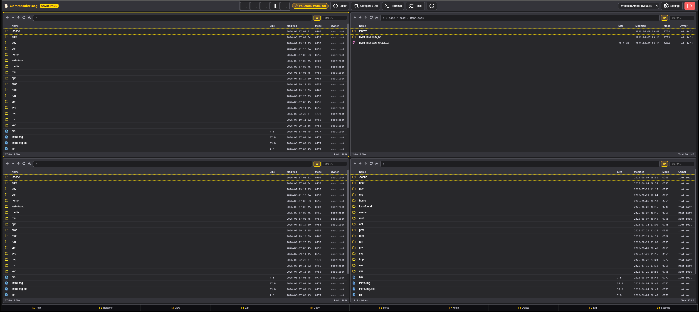

# 🐕 CommanderDog

<div align="center">
  
  <p><em>Multi-Tab Web Commander - By Woofson</em></p>
</div>

---

## ✨ Features

- 🗂️ **Dynamic 1-to-4 Toggleable Panes**: Switch seamlessly between Single, Dual-Vertical, Dual-Horizontal, Triple, and 2x2 Quad layouts (`Alt+1`–`4`).
- 🎨 **Leftmost Unified Pane Customization (`[ 🟡 1 ]`, `[ 🟢 2 ]`, ...)**:
  - Clean non-redundant pane identifiers (`1`, `2`, `3`, `4`) placed at the far left of each toolbar.
  - 1-Click popover: In-place renaming, 9 color swatches + custom hex color picker, border width (`1px`–`4px`), and active ring styles.
- ⚡ **Orthodox Commander Keybindings**: Full keyboard control (`Tab` switch pane, `F1` Help, `F2` Rename, `F3` Quick View, `F4` Dual-Pane Editor, `F5` Copy, `F6` Move, `F7` Mkdir, `F8` Delete/Trash, `F9`/`Ctrl+D` Diff, `F10` Settings, `Insert`/`Space` multi-select, `Shift+F6` Bulk Rename, `Ctrl+C`/`X`/`V` Clipboard, `Ctrl+K` Spotlight).
- 🖱️ **Enhanced Mouse & Touch Controls**:
  - **Double-Click Empty Space Navigation**: Double-click anywhere on empty panel space to jump up one directory level.
  - **Empty-Space Context Menu**: Right-click blank space to create new files/folders, paste clipboard items, open terminal, or analyze disk usage.
  - **Mobile Touch Engine**: 450ms haptic long-press for context menu, swipe gestures, and auto-dismissing app dropdowns.
- 🛡️ **Filesystem Sandboxing & Storage Roots (`[storage]`)**:
  - Confine users and admins to explicit storage roots (`[[storage.roots]]`) and personal `$HOME` folders with `allow_entire_system = false`.
  - Granular per-user allowed roots list and read-only volume protection.
- 🔒 **Zero-Leakage In-Memory Credential Security**:
  - Volatile in-memory authentication router (`resolveAuthUri`) prevents passwords from ever being stored in `localStorage`, URL history, search inputs, or DOM attributes.
  - Automated URI sanitization across all displays, toasts, and backend endpoints.
- ⚡ **DeltaCopy / RoboCopy / TeraCopy Engine**:
  - **Delta Skip**: Automatically skips identical unchanged files (size & modification timestamp match) for high-speed incremental transfers.
  - **TeraCopy Checksum**: Optional bit-for-bit CRC32 / SHA-256 integrity verification post-transfer.
  - **RoboCopy Retry**: Auto-retries busy/locked files up to 3 times with exponential backoff.
  - **Resume Partial**: Automatically resumes interrupted file transfers.
  - **Preserves Metadata**: Retains original timestamps (`mtime`) and Unix permissions (`chmod`).
- 📊 **Real-Time Background Task Queue & Speed Monitor**:
  - Floating transfer status pill in the bottom-right corner.
  - Live throughput calculations (MB/s), dynamic ETA countdowns, animated progress bars, and cancellation controls.
- 🖼️ **Built-in Rich Image Viewer**:
  - Supports `.png`, `.jpg`, `.jpeg`, `.webp`, `.svg`, `.gif`, `.bmp`, `.ico`, `.avif`, `.tiff`.
  - Zoom in/out, fit-to-screen, rotate 90°, flip horizontal/vertical, live resolution badges, and slideshow arrow navigation (`◀` / `▶`).
- 🏷️ **Advanced Multi-File Bulk Renamer**:
  - **Find & Replace**: Case-sensitive and full Regular Expressions (Regex) support.
  - **Sequential Numbering**: Base name, start index, step, and custom digit padding (`001`).
  - **Prefix & Suffix**: Prepend or append text without losing extensions.
  - **Case Conversion**: `UPPERCASE`, `lowercase`, `Title Case`, `kebab-case`, `snake_case`.
  - **Extension Management**: Batch normalize extensions.
  - **Conflict Prevention**: Real-time side-by-side preview with collision warning.
- 💻 **Slide-Up Native Web Terminal (PTY)**:
  - Toggle with `Ctrl+\`` or from the Tools menu.
  - Native Linux pseudo-terminal running `bash`/`sh` over WebSockets, starting in the active pane's current directory.
- 🌐 **Protocols & Cloud Object Storage Manager**:
  - **Local Linux Filesystem** (with Zero-Dependency Dynamic PAM login)
  - **SFTP / SSH**: Remote server support with automatic `$HOME` resolution and 1-click disconnect
  - **🪟 Samba / Windows Shares (SMB / CIFS)**: Port 445 / 139 with domain & guest authentication (`smb://`)
  - **🐧 NFS (Network File System)**: NFSv3 / NFSv4 automated export mounting & discovery (`nfs://`)
  - **📦 Hetzner Storage Box**: Dedicated fast preset (SFTP port 23 & WebDAV HTTPS)
  - **WebDAV**: Nextcloud, ownCloud, Synology, Apache/Nginx
  - **☁️ S3 Cloud Object Storage**: AWS S3, MinIO, Cloudflare R2, Backblaze B2, Hetzner S3 (SigV4 signing)
  - **🛡️ Proton Drive**: End-to-end encrypted (E2EE) storage via Proton CLI & FUSE bridges
  - **🔄 Syncthing**: Live background sync dashboard, peer throughput, in-sync progress, and scan triggers
  - **Virtual Archives**: Open `.zip`, `.tar.gz`, `.tar.bz2`, `.tar.xz`, `.7z` directly as virtual directories with 1-click close.
- 🔒 **Visual Unix Permissions & Ownership Manager**:
  - 3x3 interactive `chmod` matrix (Read, Write, Execute for Owner, Group, Others) with live octal calculation.
  - 1-Click presets (`0644`, `0755`, `0600`, `0700`, `0777`).
  - Live system user and group dropdowns reading `/etc/passwd` and `/etc/group` for `chown`.
  - Recursive (`-R`) permission application.
- 🛡️ **Paranoid File Handling Mode**:
  - Pre-flight dry run collision and disk space inspection
  - Post-transfer cryptographic SHA-256 integrity verification
  - Atomic writes & safe XDG Trash bin recovery.
- 👑 **Dedicated Administrator Control Panel & Granular RBAC**:
  - Full separation between regular **User Settings & Themes (`F10`)** and the **👑 Admin Control Panel**.
  - Multi-user RBAC table: assign roles (`Admin`, `Standard User`, `Read-Only`), customize home directories, and grant/revoke individual protocol privileges (`Local`, `SMB/CIFS`, `NFS`, `S3`, `SFTP`, `WebDAV`, `Terminal`, `Syncthing`, `ConvertX`) and allowed storage roots.
  - Seamless auto-synchronization of Linux PAM system users (`/etc/passwd`, `/etc/group` with `sudo`/`wheel` admin resolution).
- 🌐 **Global Network Mounts & Auto-Discovery in Favorites**:
  - Administrators can mount global shares (Samba/CIFS, NFS, S3, SFTP, WebDAV) and assign access permissions to specific users or `All Users (*)`.
  - Assigned mounts automatically appear in users' **⭐ Favorites / Bookmarks** menu for 1-click navigation.
- 🔄 **ConvertX Universal File Converter**:
  - Convert images (WebP, PNG, JPEG, AVIF, BMP, TIFF), audio (MP3, WAV, AAC, FLAC, OGG), video (MP4, WebM, MKV, AVI, GIF), and documents (PDF, TXT, HTML, DOCX) directly within the browser with format quality sliders.
- 📝 **Dual-Pane Text & Markdown Editor with Syntax Highlighting**:
  - Built-in syntax highlighting for JavaScript, HTML, CSS, Rust, Python, Bash, Markdown, JSON, YAML, TOML, SQL, and Dockerfiles.
  - Interactive **Find & Replace** engine with match counter, step navigation, and Replace All.
  - Live Markdown preview with **Mermaid.js diagram rendering** (Flowcharts, sequences, Gantt charts, state diagrams).
- ⚖️ **Advanced File & Folder Diff Engine**:
  - Fast Folder Comparison (size & mtime mismatches, missing items).
  - Selected files only diff and full deep cryptographic hash comparison.
  - Side-by-side text diff with line-by-line additions, deletions, and inline token highlighting.
- 🎨 **Extensible Theme Engine & Palette Customizer**:
  - 11 built-in themes: **🐕 Woofson Amber (Default)**, **🍂 Gruvbox Dark**, **☕ Catppuccin Mocha**, **🥛 Catppuccin Latte (Light)**, **🌃 Tokyo Night**, **🔥 Monokai Pro**, **☀️ Solarized Dark**, **✨ Ayu Dark**, **❄️ Nord Frost**, **🧛 Dracula Dark**, **💻 Midnight Commander Blue**.
  - **External TOML Themes**: Drop custom `.toml` themes into `~/.config/commanderdog/themes/` or `/etc/commanderdog/themes/`.
  - **Web Custom Theme Creator**: Build, preview, and export custom themes directly within the Web UI.
- ⚙️ **Unified Fast-Path XDG Configuration**:
  - Single master `config.toml` loaded with sub-millisecond speed: `~/.config/commanderdog/config.toml` (or `/etc/commanderdog/config.toml`). Zero `conf.d` directory fragmentation.
- 🪟 **Native Desktop Window & Tiling WM Support**:
  - Standalone native window mode via WebKitGTK / WebView2 (`commanderdog --standalone`).
  - Seamless borderless / frameless mode for tiling window managers (Hyprland, Sway, i3) via `--no-decorations`.
- 🐳 **Docker, Proxmox & LXC Ready**: Standalone single binary with embedded web frontend, Arch AUR package (`commanderdog`), Docker images on GHCR (`ghcr.io/woofson/commanderdog`), Debian `.deb`, Alpine `.apk`, and Proxmox deployment guide (`LXC.md`).

---

## 🚀 Quick Start

### Build & Run Locally (Rust)

```bash
# Build release binary
cargo build --release

# Run CommanderDog
./target/release/commanderdog
```

Open your browser at **http://localhost:3140**  
Default credentials:
- **Username**: `admin`
- **Password**: `commanderdog`  
*(Or log in directly with any Linux system account on the host!)*

---

## 📦 Native Packages & AUR

- **Arch Linux / CachyOS (AUR)**:
  ```bash
  yay -S commanderdog
  # or
  paru -S commanderdog
  ```
- **Debian / Ubuntu**: Install pre-built `.deb` (`sudo dpkg -i commanderdog_*.deb`).
- **Proxmox VE / Linux LXC**: See the complete [LXC.md](file:///home/bolt/projects/commanderdog/LXC.md) guide or run `scripts/lxc-install.sh`.

---

## 🐳 Docker Setup

### Docker Run (Quickest)
```bash
docker run -d \
  --name commanderdog \
  -p 3140:3140 \
  -v ./data:/data \
  -v /home:/mnt/home:rw \
  -v /mnt/storage:/mnt/storage:rw \
  --restart unless-stopped \
  ghcr.io/woofson/commanderdog:latest
```

### Docker Compose
```bash
docker compose up -d
```

---

## 🌐 Reverse Proxies, Tailscale & NetBird

CommanderDog is engineered to run seamlessly behind reverse proxies, mesh VPNs, and tunnels:
- 🦎 **[Tailscale Setup Guide](REVERSE_PROXY.md#1-tailscale)**: MagicDNS HTTPS with `tailscale serve` or `tailscale funnel`.
- 🦅 **[NetBird Setup Guide](REVERSE_PROXY.md#2-netbird)**: WireGuard peer-to-peer overlay network access.
- 🔒 **[Caddy 2 Guide](REVERSE_PROXY.md#3-caddy-2-recommended)**: 3-line automatic TLS & WebSocket reverse proxy.
- 🌐 **[Nginx & NPM Guide](REVERSE_PROXY.md#4-nginx)**: WebSocket upgrade, buffer tuning, and timeout configurations.
- 🚦 **[Traefik v2/v3 Guide](REVERSE_PROXY.md#6-traefik-v2--v3)**: Docker compose labels and buffering middleware.
- ☁️ **[Cloudflare Tunnel Guide](REVERSE_PROXY.md#7-cloudflare-tunnel-cloudflared)**: Zero-trust tunneling with WebSockets.
- 📦 **[Proxmox LXC Guide](LXC.md)**: 1-click Proxmox VE / Debian container deployment.

---

## 📁 Configuration File Structure

CommanderDog loads configuration in a single sub-millisecond pass from:
- **`~/.config/commanderdog/config.toml`** *(Highest priority for personal ricing & dotfiles)*
- **`/etc/commanderdog/config.toml`** *(System-wide fallback)*
- **`~/.config/commanderdog/themes/*.toml`** *(Modular custom theme drops)*

```toml
# ~/.config/commanderdog/config.toml
[server]
host = "0.0.0.0"
port = 3140

[storage]
allow_entire_system = false # Sandboxes users to allowed storage roots + $HOME

[[storage.roots]]
id = "storage"
name = "Mass Storage"
path = "/mnt/storage"
read_only = false

[ui]
default_pane_count = 2
default_layout = "dual-vertical" # single, dual-vertical, dual-horizontal, triple, quad
show_hidden_files = true
window_decorations = true        # Set false for borderless Hyprland integration
show_global_refresh = false      # Minimal header

[desktop]
minimize_to_tray = true          # Minimize to tray on close
enable_tray = true               # System tray icon
global_summon_hotkey = "Super+C" # System-wide summon keybind

[themes]
default_theme = "amber-charcoal" # Active theme ID or custom theme from themes/
```

---

## ⌨️ Function Keys & Keybindings

| Key | Action |
| :--- | :--- |
| **`Tab` / `Shift+Tab`** | Switch Active Pane |
| **`F1`** | Help & Keybindings Modal |
| **`F2`** | Rename Selected Entry |
| **`F3`** | Quick View / Rich Image Viewer |
| **`F4`** | Built-in Dual-Pane Editor & Markdown Viewer |
| **`F5`** | DeltaCopy / Transfer Modal (TeraCopy / RoboCopy engine) |
| **`F6`** | Move Selected Items to Target Pane |
| **`Shift+F6` / `Ctrl+M`** | Advanced Multi-File Bulk Renamer |
| **`F7`** | Create New Folder |
| **`F8` / `Delete`** | Delete / Move to Trash |
| **`F9` / `Ctrl+D`** | Folder & File Comparison (Diff) |
| **`F10`** | Settings Hub (General, Desktop, Palette, Bookmarks, Keys) |
| **`Ctrl+C` / `Ctrl+X` / `Ctrl+V`** | Copy, Cut, and Paste files across panels |
| **`Ctrl+\``** | Toggle Slide-Up Native Web Terminal (PTY) |
| **`Alt+1` .. `Alt+4`** | Jump to Pane 1, 2, 3, or 4 |
| **`Insert` / `Space`** | Toggle Item Selection & Step Down |
| **`Ctrl+A`** | Select All in Active Pane |
| **`Ctrl+P`** | Toggle Paranoid File Handling Mode |

---

## 🗺️ Roadmap & Changelog

- Check out the full [**CommanderDog Product & Architecture Roadmap**](ROADMAP.md) covering upcoming milestones (Transparent Encrypted Vaults, Folder Automation Watchers, Global System Tray, and Enterprise OIDC SSO).
- See detailed release history in [**CHANGELOG.md**](CHANGELOG.md).

---

## 📜 License

MIT © Bolt J Woofson
