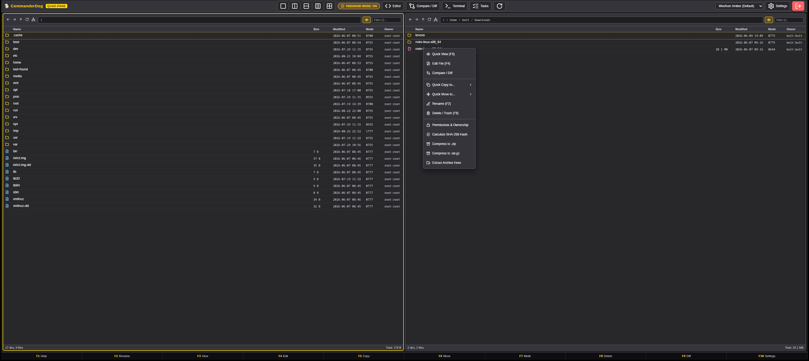

# 🐕 CommanderDog

<div align="center">
  
  <p><em>Quad-Pane High-Performance Web File Commander | Orthodox Power with Modern Polish</em></p>
</div>

---

## ✨ Features

- 🗂️ **Dynamic 1-to-4 Toggleable Panes**: Switch seamlessly between Single, Dual-Vertical, Dual-Horizontal, Triple, and 2x2 Quad layouts (`Alt+1`–`4`).
- ⚡ **Orthodox Commander Keybindings**: Full keyboard control (`Tab` switch pane, `F1` Help, `F2` Rename, `F3` Quick View, `F4` Dual-Pane Editor, `F5` Copy, `F6` Move, `F7` Mkdir, `F8` Delete/Trash, `Ctrl+D` Diff, `Insert`/`Space` multi-select, `Shift+F6` Bulk Rename).
- 🖱️ **Drag & Drop Engine**: Drag and drop effortlessly between any pane or from your host OS desktop to upload.
- ⚡ **DeltaCopy / RoboCopy / TeraCopy Engine**:
  - **Delta Skip**: Automatically skips identical unchanged files (size & modification timestamp match) for high-speed incremental transfers.
  - **TeraCopy Checksum**: Optional bit-for-bit CRC32 / SHA-256 integrity verification post-transfer.
  - **RoboCopy Retry**: Auto-retries busy/locked files up to 3 times with exponential backoff.
  - **Resume Partial**: Automatically resumes interrupted file transfers.
  - **Preserves Metadata**: Retains original timestamps (`mtime`) and Unix permissions (`chmod`).
- 📊 **Real-Time Background Task Queue & Speed Monitor**:
  - Floating transfer status pill in the bottom-right corner.
  - Live throughput calculations (MB/s), dynamic ETA countdowns, animated progress bars, and cancellation controls.
- 🖼️ **Built-in Rich Image Viewer**:
  - Supports `.png`, `.jpg`, `.jpeg`, `.webp`, `.svg`, `.gif`, `.bmp`, `.ico`, `.avif`, `.tiff`.
  - Zoom in/out, fit-to-screen, rotate 90°, flip horizontal/vertical, live resolution badges, and slideshow arrow navigation (`◀` / `▶`).
- 🏷️ **Advanced Multi-File Bulk Renamer**:
  - **Find & Replace**: Case-sensitive and full Regular Expressions (Regex) support.
  - **Sequential Numbering**: Base name, start index, step, and custom digit padding (`001`).
  - **Prefix & Suffix**: Prepend or append text without losing extensions.
  - **Case Conversion**: `UPPERCASE`, `lowercase`, `Title Case`, `kebab-case`, `snake_case`.
  - **Extension Management**: Batch normalize extensions.
  - **Conflict Prevention**: Real-time side-by-side preview with collision warning.
- 💻 **Slide-Up Native Web Terminal (PTY)**:
  - Toggle with `Ctrl+\`` or the `Terminal` button.
  - Native Linux pseudo-terminal running `bash`/`sh` over WebSockets, starting in the active pane's current directory.
- 🌐 **Protocols & Remote Connection Manager**:
  - Local Linux filesystem
  - SSH / SFTP remote servers (host, port, username, password/SSH key)
  - WebDAV remote storage (Nextcloud, ownCloud, Synology, Apache/Nginx)
  - Virtual archive browsing (open `.zip`, `.tar.gz`, `.tar.bz2`, `.tar.xz`, `.7z` directly as virtual directories).
- 🔒 **Visual Unix Permissions & Ownership Manager**:
  - 3x3 interactive `chmod` matrix (Read, Write, Execute for Owner, Group, Others) with live octal calculation.
  - 1-Click presets (`0644`, `0755`, `0600`, `0700`, `0777`).
  - Live system user and group dropdowns reading `/etc/passwd` and `/etc/group` for `chown`.
  - Recursive (`-R`) permission application.
- 🛡️ **Paranoid File Handling Mode**:
  - Pre-flight dry run collision and disk space inspection
  - Post-transfer cryptographic SHA-256 integrity verification
  - Atomic writes & safe XDG Trash bin recovery.
- ⚖️ **Side-by-Side File & Folder Diff**:
  - Visual folder comparison (count, size mismatches, hash differences, missing files)
  - Side-by-side text file diff with line-by-line additions, deletions, and inline highlights.
- 📝 **Dual-Pane Text & Markdown Editor**:
  - Built-in side-by-side file editor
  - Live Markdown preview with **Mermaid.js diagram rendering** (Flowcharts, sequences, Gantt charts, state diagrams).
- 🎨 **11 Themes Suite**:
  - **🐕 Woofson Amber (Default)**
  - **🍂 Gruvbox Dark**
  - **☕ Catppuccin Mocha**
  - **🥛 Catppuccin Latte (Light)**
  - **🌃 Tokyo Night**
  - **🔥 Monokai Pro**
  - **☀️ Solarized Dark**
  - **✨ Ayu Dark**
  - **❄️ Nord Frost**
  - **🧛 Dracula Dark**
  - **💻 Midnight Commander Blue**
- ⚙️ **conf.d Configuration Architecture**:
  - Scans and merges snippets hierarchically from `/etc/commanderdog/conf.d/*.toml`, `~/.config/commanderdog/conf.d/*.toml`, and `./conf.d/*.toml`.
- 👥 **Multi-User Auth**: Native Linux PAM system users + Built-in SQLite user database with Argon2 password hashing.
- 🐳 **Docker & LXC Ready**: Standalone single binary with embedded web frontend and minimal container images.

---

## 🚀 Quick Start

### Build & Run Locally (Rust)

```bash
# Build release binary
cargo build --release

# Run CommanderDog
./target/release/commanderdog
```

Open your browser at **http://localhost:8080**  
Default credentials:
- **Username**: `admin`
- **Password**: `commanderdog`

---

## 🐳 Docker Setup

```bash
docker compose up -d --build
```

---

## 📁 conf.d Directory Structure

CommanderDog merges all `.toml` files in the `conf.d` directory in sorting order:

```
conf.d/
├── 00-server.toml      # Host, port, upload limits, roots
├── 10-auth.toml        # Authentication modes (mixed/builtin/pam)
├── 20-themes.toml      # Theme palettes and default appearance
└── 30-actions.toml     # Paranoid settings & context menu script actions
```

---

## ⌨️ Function Keys & Keybindings

| Key | Action |
| :--- | :--- |
| **`Tab` / `Shift+Tab`** | Switch Active Pane |
| **`F1`** | Help & Keybindings Modal |
| **`F2`** | Rename Selected Entry |
| **`F3`** | Quick View / Rich Image Viewer |
| **`F4`** | Built-in Dual-Pane Editor & Markdown Viewer |
| **`F5`** | DeltaCopy / Transfer Modal (TeraCopy / RoboCopy engine) |
| **`F6`** | Move Selected Items to Target Pane |
| **`Shift+F6` / `Ctrl+M`** | Advanced Multi-File Bulk Renamer |
| **`F7`** | Create New Folder |
| **`F8` / `Delete`** | Delete / Move to Trash |
| **`F9` / `Ctrl+D`** | Folder & File Comparison (Diff) |
| **`F10`** | Settings Hub (General, Paranoid, Palette, Bookmarks, conf.d) |
| **`Ctrl+\``** | Toggle Slide-Up Native Web Terminal (PTY) |
| **`Alt+1` .. `Alt+4`** | Jump to Pane 1, 2, 3, or 4 |
| **`Insert` / `Space`** | Toggle Item Selection & Step Down |
| **`Ctrl+A`** | Select All in Active Pane |
| **`Ctrl+P`** | Toggle Paranoid File Handling Mode |

---

## 📜 License

MIT © Bolt J Woofson
