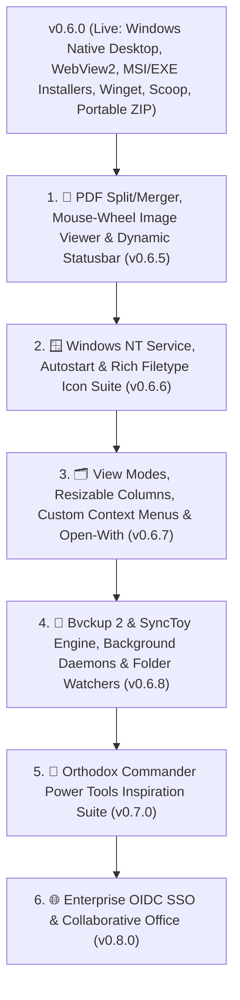

# 🗺️ CommanderDog Product Roadmap

> **Slogan**: *Multi-Tab File Commander for Web & Native Desktop — By Woofson*  
> **Current Version**: `v0.6.0 (Windows Native Desktop, Installers & Package Distribution)`

This roadmap outlines completed capabilities, active architectural enhancements, and future milestones for CommanderDog, combining orthodox two-pane file commander power tools (Total Commander, Double Commander, Krusader, Directory Opus) with modern responsive web and native standalone desktop architecture.

---

## 🦴 The Ultimate Replacement Vision: One Commander ("ChewToys")

> *"Replace a scattered suite of 10+ disconnected utilities with a single, ultra-fast, unified Commander and a suite of built-in power-tools ('ChewToys')."*

```
┌────────────────────────────────────────────────────────────────────────────────────────────┐
│ 🦴 The CommanderDog "ChewToy" Replacement Matrix                                           │
├────────────────────────┬─────────────────────────────┬─────────────────────────────────────┤
│ Legacy / External App  │ CommanderDog Native ChewToy │ Replaced Capabilities               │
├────────────────────────┼─────────────────────────────┼─────────────────────────────────────┤
│ FileZilla & Mountain D │ 🌐 Native Multi-Protocol VFS│ SFTP/SSH, SMB/CIFS, NFS, WebDAV,    │
│                        │                             │ Hetzner Storage Box, Proton Drive,  │
│                        │                             │ Google Drive & S3 Object Storage    │
├────────────────────────┼─────────────────────────────┼─────────────────────────────────────┤
│ rclone & rsync         │ ⚡ DeltaCopy / RoboCopy     │ Differential delta streaming,       │
│                        │ Engine & Background Tasks   │ bandwidth throttling & auto-retry   │
├────────────────────────┼─────────────────────────────┼─────────────────────────────────────┤
│ Bvckup 2 & SyncToy     │ 🔄 Delta Backup & Sync      │ Two-Way Sync, Echo/Mirror,          │
│                        │ Engine (v0.6.8)             │ Contribute, Archive/Versioning,     │
│                        │                             │ USN Journal change indexing         │
├────────────────────────┼─────────────────────────────┼─────────────────────────────────────┤
│ Syncthing              │ 🔄 Live Syncthing Dashboard │ Peer status, throughput charts,     │
│                        │ & Direct Local/LAN Sync     │ folder scan triggers, P2P sync      │
├────────────────────────┼─────────────────────────────┼─────────────────────────────────────┤
│ PuTTY & OpenSSH SCP    │ 💻 Slide-Up PTY Web Terminal│ Embedded WebSocket pseudo-terminal  │
│                        │ & Secure File Pipeline      │ (bash/sh/powershell) in active path │
├────────────────────────┼─────────────────────────────┼─────────────────────────────────────┤
│ Total / Multi / MC /   │ 🗂️ 1-to-4 Multi-Tab Dynamic │ Orthodox keyboard shortcuts, dual-  │
│ XYplorer / Directory O │ Panes & Orthodox Suite      │ pane power diff, batch rename,      │
│                        │                             │ branch view, rich MIME icon suite   │
├────────────────────────┼─────────────────────────────┼─────────────────────────────────────┤
│ Cryptomator / VeraCrypt│ 🔒 AES-256-GCM Vaults       │ Zero-leakage in-memory containers   │
│                        │ (.cdvault)                  │ (Argon2id + AES-GCM RAM-only VFS)   │
├────────────────────────┼─────────────────────────────┼─────────────────────────────────────┤
│ HandBrake / FFmpeg GUI │ 🔄 ConvertX Transcoder      │ Browser-native image/audio/video/   │
│                        │                             │ document conversion engine          │
├────────────────────────┼─────────────────────────────┼─────────────────────────────────────┤
│ PDFsam / Acrobat Split │ 📄 PDF Power Studio         │ Pure-Rust visual merge, split,      │
│                        │ (v0.6.5)                    │ page reordering & rotation grid     │
├────────────────────────┼─────────────────────────────┼─────────────────────────────────────┤
│ FastStone / Feh Viewer │ 🖼️ High-DPI Image Viewer    │ Mouse wheel browse, focal zoom,     │
│                        │                             │ slideshow, format conversion        │
└────────────────────────┴─────────────────────────────┴─────────────────────────────────────┘
```

---

## 🚀 1. Completed Milestones (v0.1.0 — v0.6.0)

### 🪟 Windows Native Desktop, Installers & Packaging (`v0.6.0`)
- [x] **Native Windows Desktop Integration (`CommanderDog.exe`)**:
  - Rust + Microsoft WebView2 (Edge Chromium) standalone desktop integration via Tauri v2 with embedded local server.
  - Windows System Tray icon, minimize-to-tray background handling, and smooth hardware acceleration.
- [x] **Windows Packaging & Installers**:
  - **Setup Installer (`.msi` / `.exe`)**: Automated NSIS & WiX installer packages with Desktop/Start Menu shortcuts.
  - **Portable `.zip` Distribution**: Standalone zero-install archive with portable config & database support.
  - **Package Managers**: Automated manifests for `winget install Woofson.CommanderDog` and Scoop bucket (`packaging/windows/`).
  - **Windows Explorer Context Menu**: 1-click `.reg` integration scripts adding *"Open in CommanderDog"* to directories and drives.
- [x] **Windows Filesystem & UNC Path Engine**:
  - Drive letter navigation (`C:\`, `D:\`, `Z:\`), Windows environment profile expansion (`%USERPROFILE%`, `%APPDATA%`, `%LOCALAPPDATA%`, `%TEMP%`), and Windows SMB UNC network shares (`\\server\share`).
  - Slide-up terminal console defaulting to Windows PowerShell / `COMSPEC` (`cmd.exe`).
- [x] **Automated Windows CI/CD Release Matrix**:
  - GitHub Actions workflow (`.github/workflows/release.yml`) targeting `x86_64-pc-windows-msvc` and attaching releases to GitHub tags.

### 🔒 Transparent Encrypted Vaults & Subsystem Deletions (`v0.5.5`)
- [x] **Transparent Encrypted Vaults (`.cdvault` / `.cdv`)**:
  - Zero-knowledge, self-contained password-protected virtual filesystem containers with AES-256-GCM authenticated encryption and Argon2id key derivation.
  - In-memory on-the-fly streaming with zero plaintext disk leakage and automatic inactivity lock timers.
- [x] **Subsystem & Cross-Mount Deletion Engine**:
  - Implemented cross-device copy+delete fallback for trash operations overcoming Linux `EXDEV` partition limitations.

### 🔒 Security, UI Modernization & Streamlined UX (`v0.5.0`)
- [x] **Zero-Leakage Credential Security & URI Sanitization**:
  - Backend and frontend sanitization across SFTP/SMB listings, Deep Search, Spotlight, Disk Usage, and toasts.
  - Ephemeral in-memory auth routing (`resolveAuthUri`) keeping passwords out of the DOM, history, and localStorage.
- [x] **Leftmost Unified Pane Customization**:
  - Streamlined `[ 🟡 1 ]` button on pane headers with 1-click popover: Renaming, 9-preset color swatches + hex picker, and border styling.
- [x] **Streamlined Top Navbar & App Launcher**:
  - Modern `layout-grid` app launcher icon; Settings unified into the User Profile menu and <kbd>F10</kbd>.
- [x] **Touch & Click Dropdown Auto-Dismiss**:
  - Opening tools automatically closes dropdowns cleanly on mobile, tablet, and desktop.
- [x] **1-Click Remote Disconnect & Close Archive**:
  - Instant `[ 🔌 ]` Unplug and `[ ✕ ]` Close Archive chips at index 0 on breadcrumbs.

---

## 🎯 2. What's Next on the Roadmap?



---

### 📄 Milestone 1: PDF Split/Merger, Mouse-Wheel Image Viewer & Dynamic Statusbar (`v0.6.5`)
- **Multi-File PDF Merger**:
  - Combine multiple selected PDF documents into a single unified PDF with 1-click from pane selection.
  - Interactive drag-and-drop page and document reordering table.
  - Merge options: Table of Contents / Bookmark generation, page numbering stamps, and metadata preservation.
- **Precision PDF Splitter & Extractor**:
  - Split by page ranges (e.g., `1-4, 7, 10-15`), extract all pages as individual PDFs, or split into $N$-page bundles.
  - Split by bookmark chapters / outline sections.
- **Visual Page Organizer & Reorder Grid**:
  - Live thumbnail grid preview of all pages in the active document.
  - Rotate pages clockwise/counter-clockwise ($90^\circ / 180^\circ / 270^\circ$).
  - Delete blank or unwanted pages before export.
- **Pure-Rust High-Performance Engine (`lopdf` / `pdf-writer`)**:
  - Zero external dependency (runs without Ghostscript or Python).
  - Blazing-fast in-memory streaming and lossless compression.
- **🖼️ Enhanced Image Viewer with Mouse Wheel Navigation**:
  - **Mouse Wheel Next/Previous Cycling**: Scroll mouse wheel up/down to instantly navigate through adjacent images in the folder.
  - **Configurable Wheel Behavior**: 1-Click toggle in Viewer settings: *Scroll to Browse Images* vs. *Scroll to Zoom*.
  - **<kbd>Ctrl</kbd> + Wheel Precision Zoom**: Smooth cursor-centered focal zoom with double-click reset to fit-to-screen.
  - **Intelligent Preload Cache**: Preload neighboring images in background for instant, zero-latency slideshow navigation.
- **📊 Dynamic Selection Statusbar in Each Tab/Pane**:
  - Real-time selection counters in pane footer: e.g. `3 / 142 items selected (45.2 MB of 1.8 GB)`.
  - Detailed breakdown on multi-select: shows count of selected folders vs. files and total calculated byte size.
- **⌨️ Function Keys Bar Customizer**:
  - Settings toggle to show/hide the bottom <kbd>F1</kbd>..<kbd>F10</kbd> function bar.
  - Configurable button labels and keybind reassignments.

---

### 🪟 Milestone 2: Windows Background Service, Autostart & Rich Filetype Icon Suite (`v0.6.6`)
- **🎨 Rich File & Folder Icon Suite**:
  - **Native System Shell Icon Extraction**: On Windows and Linux, dynamically query file associations and display crisp native application icons for `.exe`, `.docx`, `.pdf`, `.psd`, etc.
  - **Expanded MIME Vector Icons**: Over 100+ specialized high-DPI vector icons for programming languages, 3D models (`.stl`, `.obj`), disc images (`.iso`), database files (`.sqlite`, `.db`), audio/video codecs, and configuration formats.
  - **Custom Folder Badging & Color Coding**: Color-code individual folders or assign custom badge icons (e.g. Git repo, Project, Archive, Vault).
  - **Multi-Resolution Windows `.ico` Bundle**: Crisp 16x16, 24x24, 32x32, 48x48, 64x64, 128x128, 256x256 icons crafted for Windows taskbar, Start Menu, and Explorer.
- **Official Windows NT Service Architecture (`windows-service`)**:
  - Run CommanderDog server headlessly in the background as a registered Windows Service (`services.msc`).
  - CLI management commands:
    ```powershell
    commanderdog.exe service install   # Registers CommanderDog NT Service
    commanderdog.exe service uninstall # Removes NT Service cleanly
    commanderdog.exe service start     # Starts background service
    commanderdog.exe service stop      # Graceful service shutdown
    commanderdog.exe service status    # Service health & uptime query
    ```
  - Native Windows Event Log (`eventvwr.msc`) integration for audit and error tracking.
- **User Logon Autostart & System Tray Minimization**:
  - 1-Click toggle in Settings / Tray: *"Start on Windows Startup"*.
  - Configurable start mode: Launch minimized directly into the System Tray with web server active (`--minimized` / `--tray-only`).

---

### 🗂️ Milestone 3: View Modes, Resizable Columns, Custom Context Menus & Open-With (`v0.6.7`)
- **📐 Interactive Resizable & Customizable Table Columns**:
  - **Drag-to-Resize Dividers**: Grab column header borders to dynamically resize Name, Size, Modified, Permissions, Owner, etc.
  - **Custom Column Builder**: Choose which columns to display or hide per pane:
    - *Standard*: Name, Extension, File Size, Date Modified, Date Created.
    - *Security / Unix*: Permissions (Octal / POSIX), Owner, Group, Attributes.
    - *Integrity & Version Control*: SHA-256 Checksum, Git Status Badge, Color Tags.
  - **Sticky Widths & Layout Persistence**: Save column widths to browser localStorage or global `config.toml`.
- **🖼️ Multiple Pane View Modes**:
  - **Detailed List Table (Default)**: Full orthodox metadata view.
  - **Thumbnail Gallery / Grid View**: Adjustable-size preview cards (Small, Medium, Large, Extra Large) with live image/video/PDF thumbnails.
  - **Compact Multi-Column List**: Classic Commander high-density layout fitting maximum files per screen.
  - **Togglable Directory Tree Pane**: Optional collapsible folder tree sidebar on the left side of any pane for hierarchical drive/directory navigation without pinned shortcuts.
- **🚀 Custom "Open With..." & Default Application Configurator**:
  - Configure default external programs in Settings per file extension (e.g. Video $\rightarrow$ `vlc "%1"`, Images $\rightarrow$ `fsviewer.exe` / `feh "%1"`, Code $\rightarrow$ `code "%1"` / `notepad++`).
  - Right-click *"Open With..."* submenu listing configured external apps and system default handler.
- **🖱️ Fully Customizable Right-Click Context Menu**:
  - **Context Menu Editor in Settings**: Enable, disable, or reorder context menu actions.
  - **Custom Shell Actions Builder**: Define custom commands and scripts with parameter tokens (`{file}`, `{dir}`, `{selection}`, `{target_pane}`).
  - **Submenu Organizer**: Group custom scripts into custom nested submenus (e.g. *Git Tools*, *Media Tools*, *Development*).

---

### 🔄 Milestone 4: Bvckup 2 & SyncToy Delta Backup Engine, Background Tasks & Automation (`v0.6.8`)
- **🔄 Bvckup 2 & SyncToy Backup & Sync Engine**:
  - **Flexible Synchronization Profiles**:
    - **Synchronize (Two-Way Sync)**: Bi-directional replication with automatic collision detection and smart conflict resolution.
    - **Echo / Mirror (One-Way Backup)**: Make Destination an exact mirror of Source (left-to-right), propagating additions, edits, and deletions.
    - **Contribute / Additive Backup**: Replicate additions and modifications from Source to Destination without deleting destination files that no longer exist on Source.
    - **Subscribe / Historical Versioning**: Retain file version history, moving modified and deleted files into timestamped `_archive/` snapshots or `.trash/` containers with retention policies (e.g. keep $N$ versions or purge after 30 days).
  - **⚡ Block-Level Delta Copy Engine (Bvckup 2 Speed)**:
    - **In-Place Delta Patching**: Scans large modified files (databases, virtual disks, video projects, logs) and transfers only modified byte chunks rather than copying whole files.
    - **Fast Change Indexing**: Leverages filesystem change journals (Windows USN Journal / Change Notifications) and Linux inotify / fanotify to detect changes in milliseconds without crawling million-file trees.
    - **Integrity Validation**: Optional post-transfer cryptographic verification (CRC32, SHA-256) ensuring bit-perfect backups.
- **🕒 Background Daemons & Scheduled Tasks**:
  - **Windows Service & Task Scheduler**:
    - Execute scheduled backup jobs headlessly via Windows Task Scheduler (`schtasks.exe`) or the background Windows NT Service (`commanderdog.exe service`).
    - Run tasks silently on system boot before user login.
  - **Linux Systemd & Cron Integration**:
    - Manage background backup daemons via `systemctl --user` timers, cron jobs, or embedded Tokio worker tasks.
  - **Smart Automated Triggers**:
    - **Real-Time Continuous**: Trigger backup immediately upon file modification.
    - **Periodic / Cron Schedules**: Custom recurrence (e.g. every 15 minutes, hourly, daily at 02:00 AM, or weekly).
    - **On Device / Network Share Connect**: Automatically run backup tasks when an external USB drive, SSD, or network share (`smb://`, `sftp://`, `nfs://`, `s3://`) is mounted or detected.
- **⚙️ Folder Automation Watchers & Webhooks**:
  - Automatically convert incoming media using ConvertX.
  - Automatically extract downloaded `.zip`/`.tar.gz`/`.7z` archives.
  - Dispatch webhook notifications (Discord, Slack, Telegram, Matrix, email) on backup success or failure.

---

### 👑 Milestone 5: Orthodox Commander Power Inspiration Suite (`v0.7.0`)
*(Curated pick-and-mix power tool catalog inspired by Total Commander, Multi Commander, XYplorer, Bvckup 2, SyncToy, Directory Opus, and Next Explorer)*

```
┌─────────────────────────────────────────────────────────────────────────────┐
│ 🌟 CommanderDog Power Tools Inspiration Catalog (Pick & Mix)               │
├──────────────────────┬──────────────────────────────────────────────────────┤
│ Source Inspiration   │ Proposed CommanderDog Feature                        │
├──────────────────────┼──────────────────────────────────────────────────────┤
│ Total Commander      │ • Advanced Multi-Rename Tool (EXIF/ID3/Regex tokens) │
│                      │ • Side-by-Side Directory Compare & Synchronize Dirs  │
│                      │ • Treat Archives as Folders (virtual archive VFS)    │
│                      │ • Type-Ahead Quick Search Bar with regex filter      │
├──────────────────────┼──────────────────────────────────────────────────────┤
│ Bvckup 2 & SyncToy   │ • Block-Level Delta Backup (In-place binary diffs)   │
│                      │ • Two-Way Sync, Echo/Mirror, Contribute & Archive    │
│                      │ • Background Daemon & Scheduled Tasks (Win/Linux)    │
│                      │ • On-Device Connect & Real-time change triggers      │
├──────────────────────┼──────────────────────────────────────────────────────┤
│ Multi Commander      │ • Multi-Tab Session Workspaces (Save/Restore setups) │
│                      │ • Hash Checksum Generator & .sha256/.sfv Validator   │
│                      │ • Color-Coded File Extension Rules                   │
│                      │ • Command Line Bar with user aliases                 │
├──────────────────────┼──────────────────────────────────────────────────────┤
│ XYplorer             │ • Dual Breadcrumb Bar with Drive/History Dropdowns   │
│                      │ • Visual Filters (Show only modified today, images)  │
│                      │ • Mini-Tree (auto-collapses unused tree branches)    │
│                      │ • Portable File Associations & Custom Actions        │
├──────────────────────┼──────────────────────────────────────────────────────┤
│ Next Explorer & Opus │ • Flat / Branch View with recursive grouping         │
│                      │ • Synchronized Dual Scrolling                        │
│                      │ • Live Content Search with in-table match highlight  │
│                      │ • Built-in Byte Calculator with Hex Conversion       │
└──────────────────────┴──────────────────────────────────────────────────────┘
```

1. **🏷️ Advanced Multi-Rename Tool (Total Commander Style)**:
   - Dynamic token builder: `[N]` (name), `[E]` (extension), `[C]` (counter/step), `[YMD]` (date), `[EXIF_Date]`, `[ID3_Artist]`, `[ID3_Title]`.
   - Real-time side-by-side preview table before applying changes with 1-click Undo.
2. **🔄 Side-by-Side Directory Synchronizer**:
   - Compare two directories/panes by size, timestamp, or cryptographic checksum.
   - Visual diff showing: *Files to copy $\rightarrow$*, *Files to copy $\leftarrow$*, *Equal files*, *Conflicting files*.
   - One-click bidirectional synchronization.
3. **📁 Virtual Archive Browsing (Archives as Folders)**:
   - Seamlessly browse inside `.zip`, `.tar.gz`, `.7z`, `.rar`, `.iso`, and `.cdvault` containers without full extraction.
4. **💾 Multi-Tab Session & Workspace Management**:
   - Save entire multi-pane configurations, layouts, and open directory tabs as named Workspaces (e.g. *Dev Setup*, *Photo Editing*, *Server Management*).
5. **🔍 Type-Ahead Quick Search & Instant Filter**:
   - Press any alphanumeric key to immediately filter visible rows in real-time with wildcard (`*`, `?`) and regex support.
6. **📜 Synchronized Dual Scrolling**:
   - Lock scroll positions across left and right panes to compare directory trees side-by-side synchronously.

---

### 🌐 Milestone 6: Enterprise OIDC SSO & Collaborative Office (`v0.8.0`)
- **OpenID Connect (OIDC)**: Seamless login via Authentik, Authelia, Keycloak, Okta, and Google Workspace alongside Linux PAM.
- **Collaborative Office (WOPI)**: In-browser live editing for `.docx`, `.xlsx`, `.pptx`, `.odt`, `.ods` via ONLYOFFICE and Collabora Online integration.

---

## 📋 3. Release Version Matrix

| Version | Milestone Focus | Status |
| :--- | :--- | :--- |
| **`v0.3.0`** | In-Pane Tool Docking, ConvertX, Dual-Pane Editor | **Released** |
| **`v0.3.5`** | Wayland Native Windowing, GDK Error 71 Fix, AUR Automated Sync | **Released** |
| **`v0.3.6`** | XDG Fast-Path Config, External TOML Themes, Web Theme Creator, Tiling WM Frameless | **Released** |
| **`v0.4.0`** | Multi-Part File Splitter & Combiner, Integrated Git Client, Auto-$HOME Startup | **Released** |
| **`v0.4.1`** | Configurable Storage Roots, Filesystem Sandboxing, Per-User Root RBAC, Multi-Arch Alpine/Debian GHCR | **Released** |
| **`v0.4.2`** | Multi-Tier SSH/SFTP Auth, Dynamic PAM Zero-Dependency Engine, SFTP $HOME Resolution | **Released** |
| **`v0.5.0`** | **Zero-Leakage In-Memory Credentials, Leftmost Unified Pane Customizer, Modern Navbar, Tauri Tray** | **Released** |
| **`v0.5.5`** | **Transparent Encrypted Vaults (AES-256-GCM / Argon2id), Cross-Mount Deletion Engine** | **Released** |
| **`v0.6.0`** | **🪟 Windows Native Build & Release (MSI, Portable ZIP, Winget, Scoop, WebView2)** | **Released** |
| **`v0.6.5`** | **📄 PDF Split/Merger, Mouse-Wheel Image Navigation & Dynamic Statusbar Selection** | **Released** |
| **`v0.6.6`** | **🪟 Windows Service, Autostart Management & Rich Filetype Icon Suite** | **Released (Current)** |
| **`v0.6.7`** | **🗂️ Resizable Columns, Alternate View Modes, "Open With" App Config & Context Menus** | *Next Up* |
| **`v0.6.8`** | **🔄 Bvckup 2 & SyncToy Delta Backup, Background Daemons, Scheduled Tasks & Automation** | *Planned* |
| **`v0.7.0`** | **👑 Orthodox Commander Power Tools (Multi-Rename, Dir Sync, Workspaces, Quick Filter)** | *Planned* |
| **`v0.8.0`** | **🌐 Enterprise OIDC SSO, Collaborative Office (WOPI) & Automation Engine** | *Planned* |
