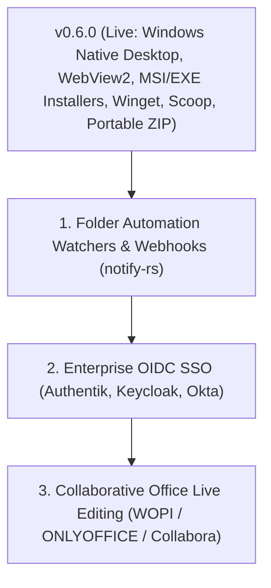

# 🗺️ CommanderDog Product Roadmap

> **Slogan**: *Multi-Tab File Commander for Web & Native Desktop — By Woofson*  
> **Current Version**: `v0.6.0 (Windows Native Desktop, Installers & Package Distribution)`

This roadmap outlines completed capabilities, active architectural enhancements, and future milestones for CommanderDog, combining orthodox two-pane file commander power tools (Total Commander, Double Commander, Krusader, Directory Opus) with modern responsive web and native standalone desktop architecture.

---

## 🚀 1. Completed Milestones (v0.1.0 — v0.6.0)

### 🪟 Windows Native Desktop, Installers & Packaging (`v0.6.0`)
- [x] **Native Windows Desktop Integration (`CommanderDog.exe`)**:
  - Rust + Microsoft WebView2 (Edge Chromium) standalone desktop integration via Tauri v2 with embedded local server.
  - Windows System Tray icon, minimize-to-tray background handling, and smooth hardware acceleration.
- [x] **Windows Packaging & Installers**:
  - **Setup Installer (`.msi` / `.exe`)**: Automated NSIS & WiX installer packages with Desktop/Start Menu shortcuts.
  - **Portable `.zip` Distribution**: Standalone zero-install archive with portable config & database support.
  - **Package Managers**: Automated manifests for `winget install Woofson.CommanderDog` and Scoop bucket (`packaging/windows/`).
  - **Windows Explorer Context Menu**: 1-click `.reg` integration scripts adding *"Open in CommanderDog"* to directories and drives.
- [x] **Windows Filesystem & UNC Path Engine**:
  - Drive letter navigation (`C:\`, `D:\`, `Z:\`), Windows environment profile expansion (`%USERPROFILE%`, `%APPDATA%`, `%LOCALAPPDATA%`, `%TEMP%`), and Windows SMB UNC network shares (`\\server\share`).
  - Slide-up terminal console defaulting to Windows PowerShell / `COMSPEC` (`cmd.exe`).
- [x] **Automated Windows CI/CD Release Matrix**:
  - GitHub Actions workflow (`.github/workflows/release.yml`) targeting `x86_64-pc-windows-msvc` and attaching releases to GitHub tags.

### 🔒 Transparent Encrypted Vaults & Subsystem Deletions (`v0.5.5`)
- [x] **Transparent Encrypted Vaults (`.cdvault` / `.cdv`)**:
  - Zero-knowledge, self-contained password-protected virtual filesystem containers with AES-256-GCM authenticated encryption and Argon2id key derivation.
  - In-memory on-the-fly streaming with zero plaintext disk leakage and automatic inactivity lock timers.
- [x] **Subsystem & Cross-Mount Deletion Engine**:
  - Implemented cross-device copy+delete fallback for trash operations overcoming Linux `EXDEV` partition limitations.

### 🔒 Security, UI Modernization & Streamlined UX (`v0.5.0`)
- [x] **Zero-Leakage Credential Security & URI Sanitization**:
  - Backend and frontend sanitization across SFTP/SMB listings, Deep Search, Spotlight, Disk Usage, and toasts.
  - Ephemeral in-memory auth routing (`resolveAuthUri`) keeping passwords out of the DOM, history, and localStorage.
- [x] **Leftmost Unified Pane Customization**:
  - Streamlined `[ 🟡 1 ]` button on pane headers with 1-click popover: Renaming, 9-preset color swatches + hex picker, and border styling.
- [x] **Streamlined Top Navbar & App Launcher**:
  - Modern `layout-grid` app launcher icon; Settings unified into the User Profile menu and <kbd>F10</kbd>.
- [x] **Touch & Click Dropdown Auto-Dismiss**:
  - Opening tools automatically closes dropdowns cleanly on mobile, tablet, and desktop.
- [x] **1-Click Remote Disconnect & Close Archive**:
  - Instant `[ 🔌 ]` Unplug and `[ ✕ ]` Close Archive chips at index 0 on breadcrumbs.

---

## 🎯 2. What's Next on the Roadmap?

### ⚙️ Milestone 1: Folder Automation Watchers & Webhooks (`v0.6.5`)
- **Real-Time Directory Watchers**: Inotify / notify-rs backend tracking specified directories.
- **Rule Engine**:
  - Automatically convert incoming images/media using ConvertX.
  - Automatically extract downloaded `.zip`/`.tar.gz`/`.7z` files.
  - Automatically trigger two-way sync or backup to remote S3/SMB/SFTP shares.
  - Execute custom user shell scripts or webhooks upon file creation/modification.

---

### 🌐 Milestone 2: Enterprise OIDC SSO & Collaborative Office (`v0.7.0`)
- **OpenID Connect (OIDC)**: Seamless login via Authentik, Authelia, Keycloak, Okta, and Google Workspace alongside Linux PAM.
- **Collaborative Office (WOPI)**: In-browser live editing for `.docx`, `.xlsx`, `.pptx`, `.odt`, `.ods` via ONLYOFFICE and Collabora Online integration.

---

## 📋 3. Release Version Matrix

| Version | Milestone Focus | Status |
| :--- | :--- | :--- |
| **`v0.3.0`** | In-Pane Tool Docking, ConvertX, Dual-Pane Editor | **Released** |
| **`v0.3.5`** | Wayland Native Windowing, GDK Error 71 Fix, AUR Automated Sync | **Released** |
| **`v0.3.6`** | XDG Fast-Path Config, External TOML Themes, Web Theme Creator, Tiling WM Frameless | **Released** |
| **`v0.4.0`** | Multi-Part File Splitter & Combiner, Integrated Git Client, Auto-$HOME Startup | **Released** |
| **`v0.4.1`** | Configurable Storage Roots, Filesystem Sandboxing, Per-User Root RBAC, Multi-Arch Alpine/Debian GHCR | **Released** |
| **`v0.4.2`** | Multi-Tier SSH/SFTP Auth, Dynamic PAM Zero-Dependency Engine, SFTP $HOME Resolution | **Released** |
| **`v0.5.0`** | **Zero-Leakage In-Memory Credentials, Leftmost Unified Pane Customizer, Modern Navbar, Tauri Tray** | **Released** |
| **`v0.5.5`** | **Transparent Encrypted Vaults (AES-256-GCM / Argon2id), Cross-Mount Deletion Engine** | **Released** |
| **`v0.6.0`** | **🪟 Windows Native Build & Release (MSI, Portable ZIP, Winget, Scoop, WebView2)** | **Released (Current)** |
| **`v0.6.5`** | **Folder Automation Watchers & Webhook Rules** | *Next Up* |
| **`v0.7.0`** | **Enterprise OIDC SSO, Collaborative Office (WOPI) & Automation Engine** | *Planned* |
