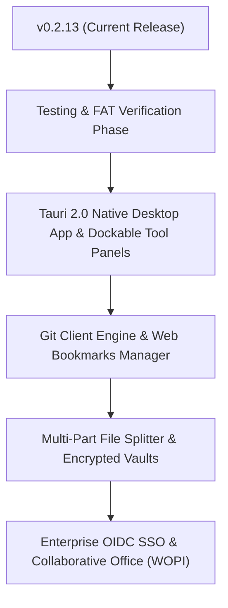

# 🗺️ CommanderDog Product Roadmap

> **Slogan**: *Multi-Tab Web Commander — By Woofson*  
> **Current Version**: `v0.2.13 (Release)`

This roadmap outlines planned capabilities, UX enhancements, and architectural milestones for CommanderDog, merging orthodox file commander power tools (Total Commander, Double Commander, Krusader, Directory Opus) with modern responsive web architecture.

---

## 🚀 1. Completed Milestones (v0.1.0 — v0.2.13)

- [x] **🧮 Built-in Floating Calculator & Byte Math (`v0.2.13`)**: Draggable & minimizable floating window with taskbar pill docking, storage byte multipliers (`KB`, `MB`, `GB`, `TB`), live base conversions (Hex, Octal/chmod, Binary), calculation history tape, 1-click clipboard copy, and native keyboard typing.
- [x] **📱 Mobile Accordion Submenus & Responsive Viewport (`v0.2.13`)**: Vertical accordion drawer submenus for touch devices ($\le 768\text{px}$), viewport height auto-sync (`--viewport-height`, `--mobile-bottom-offset`), and right-edge desktop submenu flipping (`.submenu-flip-left`).
- [x] **📱 Foldable & Adaptive Multi-Pane (`v0.3.0 UX`)**: Adaptive dual-pane breakpoint ($\ge 601\text{px}$), CSS viewport segments (`horizontal-viewport-segments: 2`), hinge/seam avoidance, and touch swipe gestures.
- [x] **🌲 Flat / Branch View (<kbd>Ctrl+B</kbd>)**: Recursive directory flattening into a unified pane view with global sorting (by size/date) and full batch operations.
- [x] **🔍 Live Content Grep & "Feed to Pane"**: Deep regex content search across trees with line snippets and 1-click **"Feed to Pane"** virtual results for batch operations.
- [x] **🏷️ Color Labels & Custom Tagging System**: SQLite-persisted color labels (🔴, 🟠, 🟡, 🟢, 🔵, 🟣) and custom text tag chips with context menu palette and interactive tag manager.
- [x] **🔀 Two-Way Visual Directory Synchronizer**: Side-by-side comparison between Left & Right directories with visual status indicators (**Newer ➔**, **Older ⬅**, **Identical ✔**, **Different Size ⚠️**, **Delete ✕**), 1-click direction override toggles, category filter chips, and Mirror/Smart 2-Way execution.
- [x] **📊 Visual Disk Usage Treemap & Storage Analyzer**: Rust recursive space aggregation engine with percentage consumption bars, 1-click folder drill-down, and Top 20 largest files table.
- [x] **📦 In-Browser Archive Engine**: Compress & Extract `.zip`, `.tar.gz`, `.tar.bz2`, `.tar.xz`, and `.7z` with custom compression levels.
- [x] **🔗 Link Sharing & Guest Upload Dropboxes**: Time/download-limited share links, password protection, guest `/share/:token` upload dropboxes, and active shares audit dashboard.
- [x] **⚡ Global Spotlight Quick-Switcher (<kbd>Ctrl+K</kbd> / <kbd>Cmd+K</kbd>)**: Real-time fuzzy command palette searching across actions, common paths, bookmarks, and recent history.
- [x] **📚 Universal Document & PDF Reader**: In-browser PDF stream viewer with zoom/rotate/print/fullscreen, rich GitHub Markdown renderer with raw toggle, CSV/TSV interactive data grids with filter and sort, and web previews.
- [x] **📸 Rich Media Inspector & EXIF GPS Geotag Engine**: TIFF/EXIF binary camera parser, interactive Leaflet + OpenStreetMap location pin with Google/Apple Maps links, dominant color palette extraction, and byte-range video/audio stream player.
- [x] **🔐 Visual POSIX Permissions Matrix**: Visual $3\times 3$ `chmod`/`chown` matrix with octal calculator and recursive `-R` toggle.
- [x] **☁️ Multi-Cloud & Remote Storage**: SMB/CIFS, NFS, AWS S3/MinIO/R2, SFTP, WebDAV, Syncthing, and Proton Drive.

---

## 🎯 2. Active Next Priorities

### 🖥️ 1. Standalone Native Desktop App (Tauri 2.0)
- **Rust + Native OS WebView**: Embed Axum local server with WebKitGTK (Linux), WebKit (macOS), and WebView2 (Windows) for ultra-low memory (~30 MB RAM) and small binary footprint (~15 MB). Zero Electron.
- **Native OS Integrations**: System tray icon with background minimize, global OS summon hotkey (e.g. <kbd>Super+C</kbd>), native OS file drag-and-drop, and native window chrome matching active theme.
- **Cross-Platform Installers & Repositories**:
  - 🐧 **Linux**: **Arch User Repository (AUR)** (`commanderdog` / `commanderdog-bin`), `.AppImage`, `.deb`, `.rpm`, `.tar.gz`.
  - 🍏 **macOS**: `.dmg`, `.app` (Universal binary for Apple Silicon & Intel), Homebrew Cask.
  - 🪟 **Windows**: `.msi`, `.exe` (NSIS Installer & Portable), WinGet.

### 🪟 2. Dockable Tool Panels (In-Pane & In-Tab Docking)
- **Transform Floating Tools into In-Pane Tabs**: 1-click `⇲ Dock into Left/Right Pane` or `Dock as Tab` on floating tools (Power Editor, Terminal, Document/Media/PDF Viewers, Quick Preview, Diff Engine, Disk Usage, and Calculator).
- **Non-Blocking Side-by-Side Workflows**: File browsing, navigation, and file actions (<kbd>F5</kbd> Copy, <kbd>F6</kbd> Move, Drag-and-Drop, Delete) continue unimpeded on one pane while viewing/editing in the other pane, eliminating modal locking.
- **1-Click Undock / Float**: Instantly pop docked panels back out into floating draggable windows (`⇱ Float`).

### 🌲 3. Integrated Git Client & Version Control Engine
- **Git Status & Branch Badges**: Real-time git status indicators for tracked directories (branch name, ahead/behind commits, modified/staged/untracked counters).
- **Visual Staging, Diffs & Commits**: 1-click stage/unstage files, side-by-side git diff inspection, commit message composer, and 1-click Push / Pull / Fetch.
- **Git Log Graph & Blame**: Visual commit history graph, tag browser, and per-line file blame viewer.

### 🌐 4. Web Bookmarks & External URI Manager
- **Universal URL / URI Bookmarking**: Save web links (`https://...`), cloud consoles, Syncthing dashboards, and custom schemes (`sftp://`, `smb://`, `ssh://`).
- **Flexible Open Targets**: Configure each bookmark to open in a new browser tab, external window, or navigate in-app.
- **Bookmark Categories & Spotlight Integration**: Organize by tags/categories and search via <kbd>Ctrl+K</kbd> Spotlight quick-switcher.

### 🏷️ 5. Custom Pane Renaming & Workspace Aliases
- **Interactive Tab & Pane Renaming**: Double-click or right-click any pane header/tab to set custom friendly labels (e.g. *"Source*", *"Backup Drive*", *"Production Server"*, *"Scratchpad"*).
- **Workspace Preset Persistence**: Persist custom pane names across sessions and layout presets.

### 🧩 6. Multi-Part File Splitter & Combiner
- **Split Large Files**: Split multi-gigabyte files into fixed-size chunks (e.g. `100MB`, `1GB`, `.001`, `.002`).
- **Join & Verify**: Concatenate split parts back into the original file with CRC32/SHA-256 integrity verification.

### 🔒 7. Transparent Encrypted Vaults (AES-256)
- **Zero-Knowledge Encrypted Folders**: Create password-protected encrypted vault directories.
- **On-the-Fly Decryption**: Files decrypt transparently in memory inside CommanderDog without exposing unencrypted files on disk.

### ⚙️ 8. Webhook & Automation Triggers
- **Folder Watchers**: Trigger automated actions when files arrive in a folder (e.g. auto-convert with ConvertX, decompress downloads, or run custom scripts).

### 🌐 9. OpenID Connect (OIDC) & SSO Integration
- **Enterprise SSO**: Support OpenID Connect (Authelia, Authentik, Keycloak, Okta, Google Workspace) alongside existing Linux PAM and SQLite auth engines.

### 📄 10. Collaborative Office Editing (ONLYOFFICE & Collabora WOPI)
- **WOPI / ONLYOFFICE Integration**: Live collaborative editing for `.docx`, `.xlsx`, `.pptx`.

---

## 📋 3. Release Phasing Matrix

