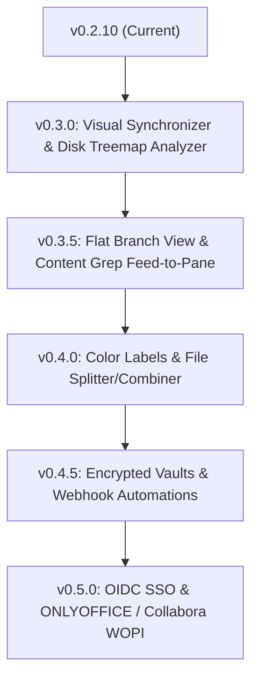

# 🗺️ CommanderDog Product Roadmap

> **Slogan**: *Multi-Tab Web Commander — By Woofson*  
> **Current Version**: `v0.2.10 (Release)`

This roadmap outlines planned capabilities, UX enhancements, and architectural milestones for CommanderDog, merging orthodox file commander power tools (Total Commander, Double Commander, Krusader, Directory Opus) with modern responsive web architecture.

---

## 🚀 1. Completed Milestones (v0.1.0 — v0.2.10)

- [x] **📱 Foldable & Adaptive Multi-Pane (`v0.3.0 UX`)**: Adaptive dual-pane breakpoint ($\ge 601\text{px}$), CSS viewport segments (`horizontal-viewport-segments: 2`), hinge/seam avoidance, and touch swipe gestures.
- [x] **📦 In-Browser Archive Engine**: Compress & Extract `.zip`, `.tar.gz`, `.tar.bz2`, `.tar.xz`, and `.7z` with custom compression levels.
- [x] **🔗 Link Sharing & Guest Upload Dropboxes**: Time/download-limited share links, password protection, guest `/share/:token` upload dropboxes, and active shares audit dashboard.
- [x] **⚡ Global Spotlight Quick-Switcher (<kbd>Ctrl+K</kbd> / <kbd>Cmd+K</kbd>)**: Real-time fuzzy command palette searching across actions, common paths, bookmarks, and recent history.
- [x] **📚 Universal Document & PDF Reader**: In-browser PDF stream viewer with zoom/rotate/print/fullscreen, rich GitHub Markdown renderer with raw toggle, CSV/TSV interactive data grids with filter and sort, and web previews.
- [x] **📸 Rich Media Inspector & EXIF GPS Geotag Engine**: TIFF/EXIF binary camera parser, interactive Leaflet + OpenStreetMap location pin with Google/Apple Maps links, dominant color palette extraction, and byte-range video/audio stream player.
- [x] **🔐 Visual POSIX Permissions Matrix**: Visual $3\times 3$ `chmod`/`chown` matrix with octal calculator and recursive `-R` toggle.
- [x] **☁️ Multi-Cloud & Remote Storage**: SMB/CIFS, NFS, AWS S3/MinIO/R2, SFTP, WebDAV, Syncthing, and Proton Drive.

---

## 🎯 2. Active Roadmap Priorities

### 🔀 A. Two-Way Visual Directory Synchronizer (Active Implementation)
- **Side-by-Side Folder Diff**: Compares Source (Pane 1) vs Destination (Pane 2) with visual status indicators (**Newer ➔**, **Older ⬅**, **Identical ✔**, **Missing ❌**, **Different Size ⚠️**).
- **Synchronize Modes**: 1-click execution for **Mirror Left-to-Right**, **Mirror Right-to-Left**, and **Smart Two-Way Sync** with conflict resolution rules.
- **Custom Direction Overrides**: Toggle per-file copy directions or skip individual files before batch synchronization.

### 📊 B. Visual Disk Usage Treemap & Sunburst Analyzer (Active Implementation)
- **Interactive Space Visualizer** (*ncdu* / *WizTree* style): Visual interactive nested blocks and bar grids showing exactly which folders and files are consuming disk space.
- **Direct Drill-Down**: Click any block in the treemap to navigate directly into that folder in the active pane or trigger cleanup actions.

---

## 🔮 3. Future Orthodox & Cloud Milestones

### 🌲 C. Flat / Branch View (<kbd>Ctrl+B</kbd>)
- **Subfolder Flattening**: Flattens the entire folder hierarchy into a single unified list inside the pane.
- **Global Sort**: Sort all nested files across hundreds of subdirectories by **File Size** (find largest files instantly) or **Date Modified**.

### 🔍 D. Live Content Grep & "Feed to Pane" Virtual Results
- **Ripgrep-Powered Content Search**: Deep regex search inside file contents across directory trees with line number and syntax-highlighted match snippets.
- **"Feed to Pane" (Classic TC Feature)**: Dumps search results directly into a virtual pane for batch selecting, renaming, or copying.

### 🏷️ E. Color Labels & Custom Tagging System
- **Visual Triage**: Color-code files and directories (🔴 Urgent/Red, 🟢 Done/Green, 🟡 WIP, 🔵 Archive).
- **Custom Tags & Filtering**: Filter by tags across panes for rapid organization.

### 🧩 F. Multi-Part File Splitter & Combiner
- **Split Large Files**: Split multi-gigabyte files into fixed-size chunks (e.g. `100MB`, `1GB`, `.001`, `.002`).
- **Join & Verify**: Concatenate split parts back into the original file with CRC32/SHA-256 integrity verification.

### 🔒 G. Transparent Encrypted Vaults (AES-256)
- **Zero-Knowledge Encrypted Folders**: Create password-protected encrypted vault directories.
- **On-the-Fly Decryption**: Files decrypt transparently in memory inside CommanderDog without exposing unencrypted files on disk.

### ⚙️ H. Webhook & Automation Triggers
- **Folder Watchers**: Trigger automated actions when files arrive in a folder (e.g. auto-convert with ConvertX, decompress downloads, or run custom scripts).

### 🌐 I. OpenID Connect (OIDC) & SSO Integration
- **Enterprise SSO**: Support OpenID Connect (Authelia, Authentik, Keycloak, Okta, Google Workspace) alongside existing Linux PAM and SQLite auth engines.

### 📄 J. Collaborative Office Editing (ONLYOFFICE & Collabora WOPI)
- **WOPI / ONLYOFFICE Integration**: Live collaborative editing for `.docx`, `.xlsx`, `.pptx`.

---

## 📋 4. Release Phasing Matrix

