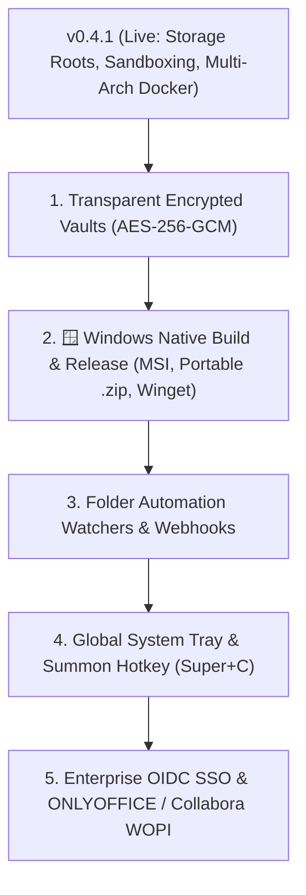

# 🗺️ CommanderDog Product Roadmap

> **Slogan**: *Multi-Tab File Commander for Web & Native Desktop — By Woofson*  
> **Current Version**: `v0.5.0 (Security, UI Modernization & Streamlined UX)`

This roadmap outlines completed capabilities, active architectural enhancements, and future milestones for CommanderDog, combining orthodox two-pane file commander power tools (Total Commander, Double Commander, Krusader, Directory Opus) with modern responsive web and native standalone desktop architecture.

---

## 🚀 1. Completed Milestones (v0.1.0 — v0.5.0)

### 🔒 Security, UI Modernization & Streamlined UX (`v0.5.0`)
- [x] **Zero-Leakage Credential Security & URI Sanitization**:
  - Backend and frontend sanitization across SFTP/SMB listings, Deep Search, Spotlight, Disk Usage, and toasts.
  - Ephemeral in-memory auth routing (`resolveAuthUri`) keeping passwords out of the DOM, history, and localStorage.
- [x] **Leftmost Unified Pane Customization**:
  - Streamlined `[ 🟡 1 ]` button on pane headers with 1-click popover: Renaming, 9-preset color swatches + hex picker, and border styling.
- [x] **Streamlined Top Navbar & App Launcher**:
  - Modern `layout-grid` app launcher icon; Settings unified into the User Profile menu and <kbd>F10</kbd>.
- [x] **Touch & Click Dropdown Auto-Dismiss**:
  - Opening tools automatically closes dropdowns cleanly on mobile, tablet, and desktop.
- [x] **1-Click Remote Disconnect & Close Archive**:
  - Instant `[ 🔌 ]` Unplug and `[ ✕ ]` Close Archive chips at index 0 on breadcrumbs.

### 🔒 Multi-Tier SSH/SFTP & Zero-Dependency PAM (`v0.4.2`)
- [x] **Multi-Tier SSH/SFTP Authentication**:
  - Password, Keyboard-Interactive, User Keys (`~/.ssh/id_*`), and SSH-Agent cascade with remote home `$HOME` resolution.
- [x] **Runtime Dynamic PAM Loading**:
  - Runtime dynamic `dlopen("libpam.so.0")` eliminating compile-time linker dependencies across Arch, CachyOS, Debian, Ubuntu, and Fedora.

### 🛡️ Storage Roots, Sandboxing & Multi-Arch Containers (`v0.4.1`)
- [x] **Configurable Storage Roots (`[[storage.roots]]`)**:
  - Configure multiple isolated root directories with `id`, `name`, `path`, `read_only`, and `allowed_roles`.
- [x] **Filesystem Sandboxing & Boundary Enforcement**:
  - `allow_entire_system = false` strictly prevents access to `/` or unauthorized host paths.
  - Unified path validation engine (`validate_path_access`) checking path normalization across all 20+ file operations.
- [x] **Per-User Allowed Roots RBAC**:
  - SQLite auto-migration adding `allowed_roots` to users and JWT claims.
  - Interactive root assignment in the Admin Control Panel.
- [x] **Dynamic Home Directory Resolution**:
  - Native Linux PAM `$HOME` resolution from `/etc/passwd` alongside configurable virtual DB home templates (`default_user_home_template`).
- [x] **Multi-Arch Docker Images on GHCR**:
  - `ghcr.io/woofson/commanderdog:alpine` (~18MB static musl) and `ghcr.io/woofson/commanderdog:latest` (~35MB Debian slim) published for `linux/amd64` and `linux/arm64`.

### 🪓 File Splitter, Git Client & User Home Startup (`v0.4.0`)
- [x] **Multi-Part File Splitter & Combiner**:
  - Split archives into chunks (`.001`, `.002`, ...) with SHA-256 integrity manifests and 1-click recombination.
- [x] **Integrated Git Client**:
  - Git status indicators, side-by-side git diff viewer, staging, commit composer, and Push/Pull/Log tools.
- [x] **Universal Tilde Expansion & User `$HOME` Startup**:
  - Automatic pane initialization in `/home/$USER` with universal tilde (`~` and `~/...`) resolution.

### 🎨 Theming, Ricing & XDG Customization (`v0.3.6`)
- [x] **Unified Fast-Path XDG Configuration**:
  - Sub-millisecond single-pass loading of `~/.config/commanderdog/config.toml` (and `/etc/commanderdog/config.toml`).
- [x] **External TOML Themes Discovery**:
  - Automatically loads custom `.toml` themes dropped into `~/.config/commanderdog/themes/`.
- [x] **In-Browser Web Custom Theme Creator & Exporter**:
  - Interactive theme designer in Settings (<kbd>F10</kbd>) with live color pickers and 1-click TOML download.
- [x] **Tiling WM Borderless Mode**:
  - `--no-decorations` / `--frameless` CLI flags and `window_decorations = false` config option for Hyprland/Sway.

### 🖥️ Native Standalone Windowing & Wayland/Hyprland (`v0.3.2` — `v0.3.5`)
- [x] **True Standalone Native Desktop Window (`commanderdog --standalone`)**:
  - WebKitGTK (Linux), WebView2 (Windows), WKWebView (macOS) with tiny ~25–35 MB RAM footprint.
- [x] **Wayland & Hyprland Explicit Sync Compatibility**:
  - Resolved `wl_surface` protocol errors (GDK Error 71) on Wayland compositors.

### 🪟 In-Pane Docking & Power Tools (`v0.3.0` — `v0.3.1`)
- [x] **In-Pane Tool Docking (`⇲ Dock / ⇱ Float`)**:
  - Dock EditorDog, Terminal Console, Byte Calculator, Background Transfers, and Git Client into any directory pane.
- [x] **ConvertX Universal File Converter**:
  - Image, audio, video, and document format converter with quality sliders.

### 🌐 Core Orthodox Commander & Multi-Cloud (`v0.1.0` — `v0.2.14`)
- [x] **Dynamic 1-to-4 Toggleable Panes** (`Alt+1`–`4`) with orthodox keyboard shortcuts (`Tab`, `F1`–`F10`, `Insert`, `Space`).
- [x] **DeltaCopy / RoboCopy / TeraCopy Engine** with bit-for-bit SHA-256 verification and resume.
- [x] **Flat / Branch View (<kbd>Ctrl+B</kbd>)** and **Live Grep with "Feed to Pane"**.
- [x] **Two-Way Directory Synchronizer** and **Visual Disk Usage Treemap Analyzer**.
- [x] **Multi-Cloud & Remote Protocols**: SMB/CIFS, NFS, AWS S3/MinIO/R2, SFTP, WebDAV, Proton Drive E2EE, and Syncthing.
- [x] **Visual POSIX Permissions Matrix** ($3\times 3$ `chmod`/`chown` with octal calculator).

---

## 🎯 2. What's Next on the Roadmap?

### 🔒 Milestone 1: Transparent Encrypted Vaults (AES-256-GCM / Argon2id)
- **Zero-Knowledge Encrypted Folders**: Create password-protected encrypted vault directories (`.vault` / `.enc`).
- **On-the-Fly Decryption**: Files decrypt transparently in memory inside CommanderDog without exposing unencrypted files on disk.
- **Auto-Lock Timeout**: Automatic vault lock when idle or when session locks.

---

### 🪟 Milestone 2: Windows Native Build & Release Pipeline
- **Native Standalone Windows Binary (`commanderdog.exe`)**:
  - Direct Rust + Microsoft WebView2 integration (Edge Chromium engine) providing a lightweight standalone desktop experience without Electron overhead.
- **Windows Packaging & Installers**:
  - **Setup Installer (`.msi` / `.exe`)**: 1-click Windows installer with Desktop & Start Menu shortcuts and optional "Open in CommanderDog" Shell context menu integration.
  - **Portable `.zip` Archive**: Zero-install standalone portable distribution for USB drives and portable toolkits.
  - **Winget & Scoop Manifests**: Package distribution via `winget install Woofson.CommanderDog` and Scoop bucket.
- **Windows Filesystem & UNC Path Engine**:
  - First-class support for Windows drive letters (`C:\`, `D:\`, `Z:\`), system user profiles (`%USERPROFILE%`), and Windows SMB UNC shares (`\\server\share`).
- **Automated Windows CI/CD Release Matrix**:
  - GitHub Actions automated build job targeting `x86_64-pc-windows-msvc` and `x86_64-pc-windows-gnu` attaching release artifacts to GitHub Releases.

---

### ⚙️ Milestone 3: Folder Automation Watchers & Webhooks
- **Real-Time Directory Watchers**: Inotify / notify-rs backend tracking specified directories.
- **Rule Engine**:
  - Automatically convert incoming images/media using ConvertX.
  - Automatically extract downloaded `.zip`/`.tar.gz`/`.7z` files.
  - Automatically trigger two-way sync or backup to remote S3/SMB/SFTP shares.
  - Execute custom user shell scripts or webhooks upon file creation/modification.

---

### 🔔 Milestone 4: Global System Tray & Desktop Integration
- **System Tray Icon**: Minimize to tray with quick status, active background transfer count, and 1-click toggle.
- **Global Summon Hotkey**: Summon CommanderDog anywhere on your system via configurable global shortcut (<kbd>Super+C</kbd> or <kbd>Ctrl+Alt+Space</kbd>).
- **Native OS Drag-and-Drop**: Drag files directly between CommanderDog and native desktop file managers (Dolphin, Nautilus, Thunar, Windows Explorer, macOS Finder).

---

### 🌐 Milestone 5: Enterprise OIDC SSO & Collaborative Office (WOPI)
- **OpenID Connect (OIDC)**: Seamless login via Authentik, Authelia, Keycloak, Okta, and Google Workspace alongside Linux PAM.
- **Collaborative Office (WOPI)**: In-browser live editing for `.docx`, `.xlsx`, `.pptx`, `.odt`, `.ods` via ONLYOFFICE and Collabora Online integration.

---

## 📋 3. Release Version Matrix

| Version | Milestone Focus | Status |
| :--- | :--- | :--- |
| **`v0.3.0`** | In-Pane Tool Docking, ConvertX, Dual-Pane Editor | **Released** |
| **`v0.3.5`** | Wayland Native Windowing, GDK Error 71 Fix, AUR Automated Sync | **Released** |
| **`v0.3.6`** | XDG Fast-Path Config, External TOML Themes, Web Theme Creator, Tiling WM Frameless | **Released** |
| **`v0.4.0`** | Multi-Part File Splitter & Combiner, Integrated Git Client, Auto-$HOME Startup | **Released** |
| **`v0.4.1`** | **Configurable Storage Roots, Filesystem Sandboxing, Per-User Root RBAC, Multi-Arch Alpine/Debian GHCR** | **Released (Current)** |
| **`v0.4.5`** | **Transparent Encrypted Vaults (AES-256-GCM)** & In-Memory Decryption | *Next Up* |
| **`v0.4.8`** | **🪟 Windows Native Build & Release (MSI, Portable ZIP, Winget, WebView2)** | *In Development* |
| **`v0.5.0`** | **Folder Automation Watchers & Webhook Rules** | *Planned* |
| **`v0.6.0`** | **System Tray, Global Summon Hotkey, Enterprise OIDC SSO & ONLYOFFICE WOPI** | *Planned* |
