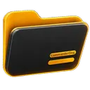
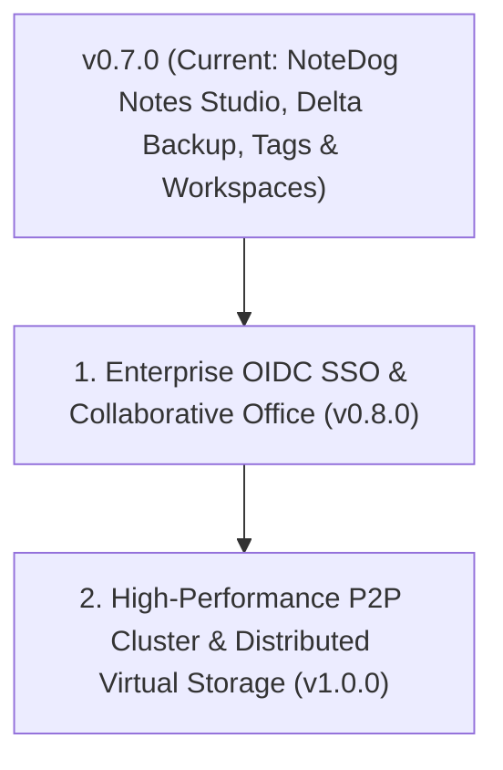
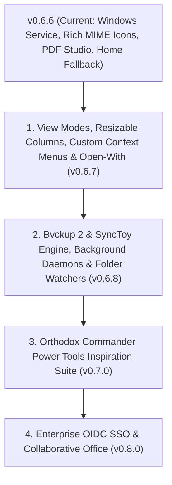

#  CommanderDog Product Roadmap

> **Slogan**: *Multi-Tab File Commander for Web & Native Desktop — By Woofson*  
> **Current Version**: `v0.7.0 (Desktop & Web)`

This roadmap outlines completed capabilities, active architectural enhancements, and future milestones for CommanderDog, combining orthodox two-pane file commander power tools (Total Commander, Double Commander, Krusader, Directory Opus) with modern responsive web and native standalone desktop architecture.

---

## The Ultimate Replacement Vision: One Commander ("ChewToys")

> *"Replace a scattered suite of 10+ disconnected utilities with a single, ultra-fast, unified Commander and a suite of built-in power-tools ('ChewToys')."*

```
┌────────────────────────────────────────────────────────────────────────────────────────────┐
│ The CommanderDog "ChewToy" Replacement Matrix                                              │
├────────────────────────┬─────────────────────────────┬─────────────────────────────────────┤
│ Legacy / External App  │ CommanderDog Native ChewToy │ Replaced Capabilities               │
├────────────────────────┼─────────────────────────────┼─────────────────────────────────────┤
│ FileZilla & Mountain D │ Native Multi-Protocol VFS   │ SFTP/SSH, SMB/CIFS, NFS, WebDAV,    │
│                        │                             │ Hetzner Storage Box, Proton Drive,  │
│                        │                             │ Google Drive & S3 Object Storage    │
├────────────────────────┼─────────────────────────────┼─────────────────────────────────────┤
│ rclone & rsync         │ DeltaCopy / RoboCopy        │ Differential delta streaming,       │
│                        │ Engine & Background Tasks   │ bandwidth throttling & auto-retry   │
├────────────────────────┼─────────────────────────────┼─────────────────────────────────────┤
│ Bvckup 2 & SyncToy     │ Delta Backup & Sync Studio  │ 4 replication profiles, in-place    │
│                        │ (v0.6.9)                    │ block deltas, snapshots & scheduler │
├────────────────────────┼─────────────────────────────┼─────────────────────────────────────┤
│ Syncthing              │ Live Syncthing Dashboard    │ Peer status, throughput charts,     │
│                        │ & Direct Local/LAN Sync     │ folder scan triggers, P2P sync      │
├────────────────────────┼─────────────────────────────┼─────────────────────────────────────┤
│ PuTTY & OpenSSH SCP    │ Slide-Up PTY Web Terminal   │ Embedded WebSocket pseudo-terminal  │
│                        │ & Secure File Pipeline      │ (bash/sh/powershell) in active path │
├────────────────────────┼─────────────────────────────┼─────────────────────────────────────┤
│ Total / Multi / MC /   │ 1-to-4 Multi-Tab Dynamic    │ Orthodox keyboard shortcuts, dual-  │
│ XYplorer / Directory O │ Panes & Orthodox Suite      │ pane power diff, batch rename,      │
│                        │                             │ branch view, rich MIME icon suite   │
├────────────────────────┼─────────────────────────────┼─────────────────────────────────────┤
│ Cryptomator / VeraCrypt│ AES-256-GCM Vaults          │ Zero-leakage in-memory containers   │
│                        │ (.cdvault)                  │ (Argon2id + AES-GCM RAM-only VFS)   │
├────────────────────────┼─────────────────────────────┼─────────────────────────────────────┤
│ HandBrake / FFmpeg GUI │ ConvertX Transcoder         │ Browser-native image/audio/video/   │
│                        │                             │ document conversion engine          │
├────────────────────────┼─────────────────────────────┼─────────────────────────────────────┤
│ PDFsam / Acrobat Split │ PDF Power Studio            │ Pure-Rust visual merge, split,      │
│                        │ (v0.6.5)                    │ page reordering & rotation grid     │
├────────────────────────┼─────────────────────────────┼─────────────────────────────────────┤
│ FastStone / Feh Viewer │ High-DPI Image Viewer       │ Mouse wheel browse, focal zoom,     │
│                        │                             │ slideshow, format conversion        │
└────────────────────────┴─────────────────────────────┴─────────────────────────────────────┘
```

---

## 1. Completed Milestones (v0.1.0 — v0.7.0)

### NoteDog Notes Studio & Orthodox Power Tools Suite (`v0.7.0`)
- [x] **NoteDog Hierarchical Markdown Notes Studio**:
  - Tree organizer notebook with subdirectories, drag-and-drop hierarchy, and fast keyword indexing.
  - Interactive checklists (`- [ ]`) and task tracking with instant DOM state persistence.
  - Built-in note templates (Meeting Notes, Project Plan, Checklist / SOP, Daily Journal).
  - Automated revision history snapshot engine under `.notedog_versions/` with side-by-side diff preview and 1-click restore.
- [x] **Color Labels, Tags & Workspaces**:
  - Direct metadata tagging with persistent SQLite indexes and custom color pills.
  - Quick filter toggles and workspace layout persistence.

### Bvckup 2 & SyncToy Delta Backup Engine, Background Daemons & Folder Watchers (`v0.6.9`)
- [x] **4 Core Replication Profiles (SyncToy & Bvckup 2)**:
  - `synchronize`: Smart bidirectional 2-way sync with newer-file conflict resolution.
  - `echo`: 1-way mirror making destination an exact replica, deleting destination orphans.
  - `contribute`: Additive replication copying additions & modifications, keeping destination orphans.
  - `subscribe`: Historical versioning archiving modified/deleted files into timestamped `_archive/` snapshot trees with automated retention pruning.
- [x] **Block-Level In-Place Binary Delta Copy Engine (Bvckup 2 Speed)**:
  - 64KB CRC32 chunk hashing skipping unmodified blocks and patching modified byte blocks in-place directly on disk.
  - Post-transfer cryptographic verification (CRC32/SHA-256).
- [x] **Automated Backup Profiles, Scheduler & Webhooks**:
  - SQLite persistent profile management with interval, daily (HH:MM), and continuous real-time triggers.
  - Webhook dispatchers (Discord/Slack/Telegram/generic JSON POST) alerting on completion or failure.
  - Execution history & audit logs tracking files copied, archived, deleted, and duration.
- [x] **Sync & Backup Studio Modal**:
  - 3-tab layout (Live Diff & Replication, Backup Jobs & Scheduler, Run History & Logs) with interactive mode cards and action filters.

### Resizable Columns, Custom Column Chooser, Multi-Size Grid & Folder Tree Sidebar (`v0.6.8`)
- [x] **Interactive Drag-to-Resize Table Columns**:
  - Grab-and-drag divider handles on all table headers (`Name`, `Ext`, `Size`, `Modified`, `Created`, `Mode`, `Owner`, `Group`, `SHA-256`, `Tags`).
  - Double-click resizer auto-fit (`autoFitColumn`) scanning DOM content widths and fitting the column perfectly.
  - Sticky width layout saved to `localStorage` per pane and globally.
- [x] **Custom Column Builder & Header Settings Popover**:
  - Right-click column header chooser popover with checkbox toggles for instant customization.
  - Quick column settings button on the pane navigation toolbar.
  - Support for *Date Created*, *SHA-256 Checksums*, and *Color Labels / Custom Tags* in table rows.
- [x] **Thumbnail Gallery Multi-Size View Modes**:
  - 4 card preview sizes: Small (`90px`), Medium (`130px`), Large (`180px`), Extra Large (`260px`).
  - Rich preview cards for images, videos, documents, audio discs, and folders with item counts.
- [x] **Collapsible Directory Tree Sidebar Per Pane**:
  - Toggle folder tree button `[ 🌳 ]` on any pane header.
  - Dynamic asynchronous subfolder expansion on click.
  - Automatic active node highlighting matching active pane directory navigation.
  - Draggable sidebar resizer with `localStorage` width persistence.

### Orthodox Context Menus, Properties Dialog & GFM Markdown (`v0.6.7`)
- [x] **Orthodox Right-Click Context Menu & Submenus**:
  - Full-width viewport & touch fix: Removed pointer media query constraints and restored `overflow: visible` on context menu containers.
  - Dynamic collision detection: Automatically flips submenus to the left if near screen edge and adjusts vertical offsets upward when near viewport bottom.
  - Reorganized functional tiers matching orthodox specifications (Open with, Quick view, Edit, Properties, Copy/Move to, Clipboard actions, Archive submenu, Tools submenu).
- [x] **Windows-Style Properties Dialog (`Alt+Enter`)**:
  - 4-tabbed modal: General & Media/EXIF, Security & Permissions (3x3 matrix, octal, recursive), Checksums (SHA-256, MD5, SHA-1 with 1-click copy), Color labels & Custom tags.
- [x] **GitHub-Flavored Markdown (GFM) & HTML Rendering in EditorDog**:
  - Full raw HTML tags (`<details>`, `<summary>`, `<kbd>`, ``, `<table>`, `<div>`, etc.).
  - GitHub alerts (`> [!NOTE]`, `> [!TIP]`, `> [!WARNING]`, etc.), PrismJS code highlighting with copy buttons, and live Mermaid diagrams.
  - Dual-engine marked.js + offline fallback.
- [x] **Color Labels & Tags System**:
  - Circular color dot on header with collapsible mini palette (`[ 🔴 🟠 🟡 🟢 🔵 🟣 ✕ ] [More...]`).
  - Glowing green tag icon (`#22c55e`) when tags exist on file; inactive gray when none.
  - Dedicated simple Custom Tags modal with chip pill management.
  - Persistent color clearing in SQLite backend.

### Windows NT Service, Autostart & Rich Filetype Icon Suite (`v0.6.6`)
- [x] **Windows NT Service & Autostart Management**:
  - Headless background service management via `commanderdog service [install|uninstall|start|stop|status]`.
  - Windows registry Run key autostart and Linux desktop integration.
  - Minimization to system tray via `--minimized` / `--tray-only`.
- [x] **Extended Rich MIME Icon Suite**:
  - Over 100+ specialized high-DPI vector icons for programming languages, 3D models, databases, media codecs, and system directories.
  - Multi-resolution Windows `.ico` bundle for Windows Taskbar and Start Menu.
- [x] **Intelligent User Home Directory Fallback**:
  - Automatic resolution of PAM / LDAP / DB home directory on fresh login sessions, preventing access errors on restricted roots (`/`).

### Pure-Rust PDF Split & Merger, Mouse-Wheel Image Viewer & Dynamic Statusbar (`v0.6.5`)
- [x] **Pure-Rust PDF Engine (`lopdf`)**:
  - Merge arbitrary PDF documents with visual reordering and bookmark outlines.
  - Split by page ranges, extract each page, or split into $N$-page bundles.
  - Visual page organizer grid with 90° rotation controls per page.
- [x] **Image Viewer Mouse Wheel Navigation**:
  - Scroll mouse wheel up/down to flip through previous/next images in folder.
  - `Ctrl`+wheel cursor-centered focal zoom with instant toggle.
  - Adjacent image preloading for zero-latency slideshow navigation.
- [x] **Dynamic Selection Statusbar Counter**:
  - Live selection counter in each tab/pane footer: `3 / 142 selected (1 dir, 2 files) - Selected: 45.2 MB (of 1.8 GB)`.

---

## 2. What's Next on the Roadmap?



---

### Milestone 1: Enterprise OIDC SSO & Collaborative Office (`v0.8.0`)
- **Enterprise Identity Providers**: OpenID Connect (OIDC), OAuth2, SAML 2.0, Keycloak, Authentik, Okta, Azure AD.
- **Collaborative Document Editing**: In-browser real-time collaborative editing for markdown, code, and Office documents (Collabora / OnlyOffice WOPI integration).

### Milestone 2: High-Performance P2P Cluster & Distributed Virtual Storage (`v1.0.0`)
- **Cluster Node Mesh**: Direct peer-to-peer authenticated node clustering with distributed metadata synchronization.
- **Distributed Virtual Storage**: Multi-host unified mountpoints and automated cross-node replication.

### Windows Native Desktop, Installers & Packaging (`v0.6.0`)
- [x] **Native Windows Desktop Integration (`CommanderDog.exe`)**:
  - Rust + Microsoft WebView2 (Edge Chromium) standalone desktop integration via Tauri v2 with embedded local server.
  - Windows System Tray icon, minimize-to-tray background handling, and smooth hardware acceleration.
- [x] **Windows Packaging & Installers**:
  - **Setup Installer (`.msi` / `.exe`)**: Automated NSIS & WiX installer packages with Desktop/Start Menu shortcuts.
  - **Portable `.zip` Distribution**: Standalone zero-install archive with portable config & database support.
  - **Package Managers**: Automated manifests for `winget install Woofson.CommanderDog` and Scoop bucket (`packaging/windows/`).
  - **Windows Explorer Context Menu**: 1-click `.reg` integration scripts adding *"Open in CommanderDog"* to directories and drives.
- [x] **Windows Filesystem & UNC Path Engine**:
  - Drive letter navigation (`C:\`, `D:\`, `Z:\`), Windows environment profile expansion (`%USERPROFILE%`, `%APPDATA%`, `%LOCALAPPDATA%`, `%TEMP%`), and Windows SMB UNC network shares (`\\server\share`).
  - Slide-up terminal console defaulting to Windows PowerShell / `COMSPEC` (`cmd.exe`).
- [x] **Automated Windows CI/CD Release Matrix**:
  - GitHub Actions workflow (`.github/workflows/release.yml`) targeting `x86_64-pc-windows-msvc` and attaching releases to GitHub tags.

### Transparent Encrypted Vaults & Subsystem Deletions (`v0.5.5`)
- [x] **Transparent Encrypted Vaults (`.cdvault` / `.cdv`)**:
  - Zero-knowledge, self-contained password-protected virtual filesystem containers with AES-256-GCM authenticated encryption and Argon2id key derivation.
  - In-memory on-the-fly streaming with zero plaintext disk leakage and automatic inactivity lock timers.
- [x] **Subsystem & Cross-Mount Deletion Engine**:
  - Implemented cross-device copy+delete fallback for trash operations overcoming Linux `EXDEV` partition limitations.

### Security, UI Modernization & Streamlined UX (`v0.5.0`)
- [x] **Zero-Leakage Credential Security & URI Sanitization**:
  - Backend and frontend sanitization across SFTP/SMB listings, Deep Search, Spotlight, Disk Usage, and toasts.
  - Ephemeral in-memory auth routing (`resolveAuthUri`) keeping passwords out of the DOM, history, and localStorage.
- [x] **Leftmost Unified Pane Customization**:
  - Streamlined `[ 1 ]` button on pane headers with 1-click popover: Renaming, 9-preset color swatches + hex picker, and border styling.
- [x] **Streamlined Top Navbar & App Launcher**:
  - Modern `layout-grid` app launcher icon; Settings unified into the User Profile menu and <kbd>F10</kbd>.
- [x] **Touch & Click Dropdown Auto-Dismiss**:
  - Opening tools automatically closes dropdowns cleanly on mobile, tablet, and desktop.
- [x] **1-Click Remote Disconnect & Close Archive**:
  - Instant `[ Unplug ]` and `[ Close ]` Archive chips at index 0 on breadcrumbs.

---

## 2. What's Next on the Roadmap?



---

### Milestone 1: View Modes, Resizable Columns, Custom Context Menus & Open-With (`v0.6.7`)
- **Interactive Resizable & Customizable Table Columns**:
  - **Drag-to-Resize Dividers**: Grab column header borders to dynamically resize Name, Size, Modified, Permissions, Owner, etc.
  - **Custom Column Builder**: Choose which columns to display or hide per pane:
    - *Standard*: Name, Extension, File Size, Date Modified, Date Created.
    - *Security / Unix*: Permissions (Octal / POSIX), Owner, Group, Attributes.
    - *Integrity & Version Control*: SHA-256 Checksum, Git Status Badge, Color Tags.
  - **Sticky Widths & Layout Persistence**: Save column widths to browser localStorage or global `config.toml`.
- **Multiple Pane View Modes**:
  - **Detailed List Table (Default)**: Full orthodox metadata view.
  - **Thumbnail Gallery / Grid View**: Adjustable-size preview cards (Small, Medium, Large, Extra Large) with live image/video/PDF thumbnails.
  - **Compact Multi-Column List**: Classic Commander high-density layout fitting maximum files per screen.
  - **Togglable Directory Tree Pane**: Optional collapsible folder tree sidebar on the left side of any pane for hierarchical drive/directory navigation without pinned shortcuts.
- **Custom "Open With..." & Default Application Configurator**:
  - Configure default external programs in Settings per file extension (e.g. Video -> `vlc "%1"`, Images -> `fsviewer.exe` / `feh "%1"`, Code -> `code "%1"` / `notepad++`).
  - Right-click *"Open With..."* submenu listing configured external apps and system default handler.
- **Fully Customizable Right-Click Context Menu**:
  - **Context Menu Editor in Settings**: Enable, disable, or reorder context menu actions.
  - **Custom Shell Actions Builder**: Define custom commands and scripts with parameter tokens (`{file}`, `{dir}`, `{selection}`, `{target_pane}`).
  - **Submenu Organizer**: Group custom scripts into custom nested submenus (e.g. *Git Tools*, *Media Tools*, *Development*).

---

### Milestone 2: Bvckup 2 & SyncToy Delta Backup Engine, Background Tasks & Automation (`v0.6.8`)
- **Bvckup 2 & SyncToy Backup & Sync Engine**:
  - **Flexible Synchronization Profiles**:
    - **Synchronize (Two-Way Sync)**: Bi-directional replication with automatic collision detection and smart conflict resolution.
    - **Echo / Mirror (One-Way Backup)**: Make Destination an exact mirror of Source (left-to-right), propagating additions, edits, and deletions.
    - **Contribute / Additive Backup**: Replicate additions and modifications from Source to Destination without deleting destination files that no longer exist on Source.
    - **Subscribe / Historical Versioning**: Retain file version history, moving modified and deleted files into timestamped `_archive/` snapshots or `.trash/` containers with retention policies.
  - **Block-Level Delta Copy Engine (Bvckup 2 Speed)**:
    - **In-Place Delta Patching**: Scans large modified files (databases, virtual disks, video projects, logs) and transfers only modified byte chunks rather than copying whole files.
    - **Fast Change Indexing**: Leverages filesystem change journals (Windows USN Journal / Change Notifications) and Linux inotify / fanotify to detect changes in milliseconds without crawling million-file trees.
    - **Integrity Validation**: Optional post-transfer cryptographic verification (CRC32, SHA-256) ensuring bit-perfect backups.
- **Background Daemons & Scheduled Tasks**:
  - **Windows Service & Task Scheduler**:
    - Execute scheduled backup jobs headlessly via Windows Task Scheduler (`schtasks.exe`) or the background Windows NT Service (`commanderdog.exe service`).
    - Run tasks silently on system boot before user login.
  - **Linux Systemd & Cron Integration**:
    - Manage background backup daemons via `systemctl --user` timers, cron jobs, or embedded Tokio worker tasks.
  - **Smart Automated Triggers**:
    - **Real-Time Continuous**: Trigger backup immediately upon file modification.
    - **Periodic / Cron Schedules**: Custom recurrence (e.g. every 15 minutes, hourly, daily at 02:00 AM, or weekly).
    - **On Device / Network Share Connect**: Automatically run backup tasks when an external USB drive, SSD, or network share (`smb://`, `sftp://`, `nfs://`, `s3://`) is mounted or detected.
- **Folder Automation Watchers & Webhooks**:
  - Automatically convert incoming media using ConvertX.
  - Automatically extract downloaded `.zip`/`.tar.gz`/`.7z` archives.
  - Dispatch webhook notifications (Discord, Slack, Telegram, Matrix, email) on backup success or failure.

---

### Milestone 3: Orthodox Commander Power Inspiration Suite (`v0.7.0`)
*(Curated pick-and-mix power tool catalog inspired by Total Commander, Multi Commander, XYplorer, Bvckup 2, SyncToy, Directory Opus, and Next Explorer)*

```
┌─────────────────────────────────────────────────────────────────────────────┐
│ CommanderDog Power Tools Inspiration Catalog (Pick & Mix)                   │
├──────────────────────┬──────────────────────────────────────────────────────┤
│ Source Inspiration   │ Proposed CommanderDog Feature                        │
├──────────────────────┼──────────────────────────────────────────────────────┤
│ Total Commander      │ • Advanced Multi-Rename Tool (EXIF/ID3/Regex tokens) │
│                      │ • Side-by-Side Directory Compare & Synchronize Dirs  │
│                      │ • Treat Archives as Folders (virtual archive VFS)    │
│                      │ • Type-Ahead Quick Search Bar with regex filter      │
├──────────────────────┼──────────────────────────────────────────────────────┤
│ Bvckup 2 & SyncToy   │ • Block-Level Delta Backup (In-place binary diffs)   │
│                      │ • Two-Way Sync, Echo/Mirror, Contribute & Archive    │
│                      │ • Background Daemon & Scheduled Tasks (Win/Linux)    │
│                      │ • On-Device Connect & Real-time change triggers      │
├──────────────────────┼──────────────────────────────────────────────────────┤
│ Multi Commander      │ • Multi-Tab Session Workspaces (Save/Restore setups) │
│                      │ • Hash Checksum Generator & .sha256/.sfv Validator   │
│                      │ • Color-Coded File Extension Rules                   │
│                      │ • Command Line Bar with user aliases                 │
├──────────────────────┼──────────────────────────────────────────────────────┤
│ XYplorer             │ • Dual Breadcrumb Bar with Drive/History Dropdowns   │
│                      │ • Visual Filters (Show only modified today, images)  │
│                      │ • Mini-Tree (auto-collapses unused tree branches)    │
│                      │ • Portable File Associations & Custom Actions        │
├──────────────────────┼──────────────────────────────────────────────────────┤
│ Next Explorer & Opus │ • Flat / Branch View with recursive grouping         │
│                      │ • Synchronized Dual Scrolling                        │
│                      │ • Live Content Search with in-table match highlight  │
│                      │ • Built-in Byte Calculator with Hex Conversion       │
└──────────────────────┴──────────────────────────────────────────────────────┘
```

1. **Advanced Multi-Rename Tool (Total Commander Style)**:
   - Dynamic token builder: `[N]` (name), `[E]` (extension), `[C]` (counter/step), `[YMD]` (date), `[EXIF_Date]`, `[ID3_Artist]`, `[ID3_Title]`.
   - Real-time side-by-side preview table before applying changes with 1-click Undo.
2. **Side-by-Side Directory Synchronizer**:
   - Compare two directories/panes by size, timestamp, or cryptographic checksum.
   - Visual diff showing: *Files to copy ->*, *Files to copy <-*, *Equal files*, *Conflicting files*.
   - One-click bidirectional synchronization.
3. **Virtual Archive Browsing (Archives as Folders)**:
   - Seamlessly browse inside `.zip`, `.tar.gz`, `.7z`, `.rar`, `.iso`, and `.cdvault` containers without full extraction.
4. **Multi-Tab Session & Workspace Management**:
   - Save entire multi-pane configurations, layouts, and open directory tabs as named Workspaces (e.g. *Dev Setup*, *Photo Editing*, *Server Management*).
5. **Type-Ahead Quick Search & Instant Filter**:
   - Press any alphanumeric key to immediately filter visible rows in real-time with wildcard (`*`, `?`) and regex support.
6. **Synchronized Dual Scrolling**:
   - Lock scroll positions across left and right panes to compare directory trees side-by-side synchronously.

---

### Milestone 4: Enterprise OIDC SSO & Collaborative Office (`v0.8.0`)
- **OpenID Connect (OIDC)**: Seamless login via Authentik, Authelia, Keycloak, Okta, and Google Workspace alongside Linux PAM.
- **Collaborative Office (WOPI)**: In-browser live editing for `.docx`, `.xlsx`, `.pptx`, `.odt`, `.ods` via ONLYOFFICE and Collabora Online integration.

---

## 3. Release Version Matrix

| Version | Milestone Focus | Status |
| :--- | :--- | :--- |
| **`v0.3.0`** | In-Pane Tool Docking, ConvertX, Dual-Pane Editor | **Released** |
| **`v0.3.5`** | Wayland Native Windowing, GDK Error 71 Fix, AUR Automated Sync | **Released** |
| **`v0.3.6`** | XDG Fast-Path Config, External TOML Themes, Web Theme Creator, Tiling WM Frameless | **Released** |
| **`v0.4.0`** | Multi-Part File Splitter & Combiner, Integrated Git Client, Auto-$HOME Startup | **Released** |
| **`v0.4.1`** | Configurable Storage Roots, Filesystem Sandboxing, Per-User Root RBAC, Multi-Arch Alpine/Debian GHCR | **Released** |
| **`v0.4.2`** | Multi-Tier SSH/SFTP Auth, Dynamic PAM Zero-Dependency Engine, SFTP $HOME Resolution | **Released** |
| **`v0.5.0`** | **Zero-Leakage In-Memory Credentials, Leftmost Unified Pane Customizer, Modern Navbar, Tauri Tray** | **Released** |
| **`v0.5.5`** | **Transparent Encrypted Vaults (AES-256-GCM / Argon2id), Cross-Mount Deletion Engine** | **Released** |
| **`v0.6.0`** | **Windows Native Build & Release (MSI, Portable ZIP, Winget, Scoop, WebView2)** | **Released** |
| **`v0.6.5`** | **PDF Split/Merger, Mouse-Wheel Image Navigation & Dynamic Statusbar Selection** | **Released** |
| **`v0.6.6`** | **Windows Service, Autostart Management & Rich Filetype Icon Suite** | **Released** |
| **`v0.6.7`** | **Orthodox Context Menu, Properties Dialog, GFM & Raw HTML Editor, Tags & Colors** | **Released** |
| **`v0.6.8`** | **Resizable Columns, Custom Chooser, Multi-Size Grid & Tree Sidebar** | **Released** |
| **`v0.6.9`** | **Bvckup 2 & SyncToy Delta Backup, Background Daemons, Scheduled Tasks & Automation** | **Released** |
| **`v0.7.0`** | **NoteDog Notes Studio, Tags & Colors, Custom Workspaces & Power Suite** | **Released (Current)** |
| **`v0.8.0`** | **Enterprise OIDC SSO, Collaborative Office (WOPI) & Automation Engine** | *Next Up* |
| **`v1.0.0`** | **High-Performance P2P Cluster & Distributed Virtual Storage** | *Planned* |
