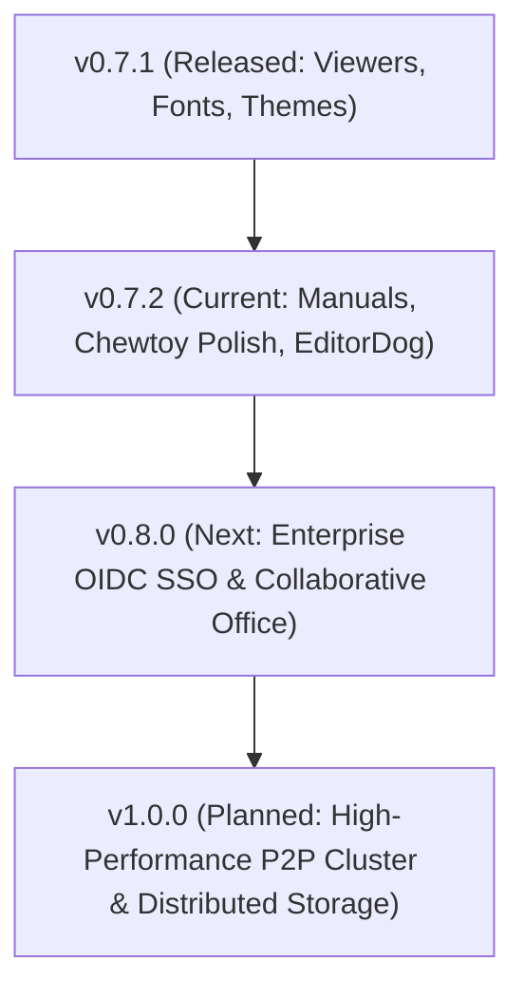

#  CommanderDog Product Roadmap & Active Backlog

> **Creator & Lab**: Bolt J Woofson @ Woofsons Lab ([www.arf.ac](https://www.arf.ac))  
> **Slogan**: *Multi-Tab File Commander for Web & Native Desktop — By Woofson*  
> **Current Version**: `v0.7.2-rc1 (Desktop & Web)`  
> **Publishing Prefix Rule**: All crates, binaries, and packages use the `arf-` or `arf_` prefix (e.g. `arf-cmdr`, `arf-remote`).  
> **Release History**: For detailed release notes and changelogs of past versions (`v0.1.0` — `v0.7.1`), see [**`CHANGELOG.md`**](CHANGELOG.md).

---

## 1. 🌟 The Ultimate Replacement Vision: One Commander ("ChewToys")

> *"Replace a scattered suite of 10+ disconnected utilities with a single, ultra-fast, unified Commander and a suite of built-in power-tools ('ChewToys')."*

```
┌────────────────────────────────────────────────────────────────────────────────────────────┐
│ The CommanderDog "ChewToy" Replacement Matrix                                              │
├────────────────────────┬─────────────────────────────┬─────────────────────────────────────┤
│ Legacy / External App  │ CommanderDog Native ChewToy │ Replaced Capabilities               │
├────────────────────────┼─────────────────────────────┼─────────────────────────────────────┤
│ FileZilla & Mountain D │ Native Multi-Protocol VFS   │ SFTP/SSH, SMB/CIFS, NFS, WebDAV,    │
│                        │                             │ Hetzner Storage Box, Proton Drive,  │
│                        │                             │ Google Drive & S3 Object Storage    │
├────────────────────────┼─────────────────────────────┼─────────────────────────────────────┤
│ rclone & rsync         │ DeltaCopy / RoboCopy        │ Differential delta streaming,       │
│                        │ Engine & Background Tasks   │ bandwidth throttling & auto-retry   │
├────────────────────────┼─────────────────────────────┼─────────────────────────────────────┤
│ Bvckup 2 & SyncToy     │ Delta Backup & Sync Studio  │ 4 replication profiles, in-place    │
│                        │                             │ block deltas, snapshots & scheduler │
├────────────────────────┼─────────────────────────────┼─────────────────────────────────────┤
│ Syncthing              │ Live Syncthing Dashboard    │ Peer status, throughput charts,     │
│                        │ & Direct Local/LAN Sync     │ folder scan triggers, P2P sync      │
├────────────────────────┼─────────────────────────────┼─────────────────────────────────────┤
│ PuTTY & OpenSSH SCP    │ Slide-Up PTY Web Terminal   │ Embedded WebSocket pseudo-terminal  │
│                        │ (Bite!)                     │ (fish/zsh/bash/powershell) in path  │
├────────────────────────┼─────────────────────────────┼─────────────────────────────────────┤
│ Total / Multi / MC /   │ 1-to-4 Multi-Tab Dynamic    │ Orthodox keyboard shortcuts, dual-  │
│ XYplorer / Directory O │ Panes & Orthodox Suite      │ pane power diff, batch rename,      │
│                        │                             │ branch view, rich MIME icon suite   │
├────────────────────────┼─────────────────────────────┼─────────────────────────────────────┤
│ Cryptomator / VeraCrypt│ AES-256-GCM Vaults          │ Zero-leakage in-memory containers   │
│                        │ (.cdvault)                  │ (Argon2id + AES-GCM RAM-only VFS)   │
├────────────────────────┼─────────────────────────────┼─────────────────────────────────────┤
│ HandBrake / FFmpeg GUI │ ConvertX Transcoder         │ Browser-native image/audio/video/   │
│                        │                             │ document conversion engine          │
├────────────────────────┼─────────────────────────────┼─────────────────────────────────────┤
│ PDFsam / Acrobat Split │ PDF Power Studio            │ Pure-Rust visual merge, split,      │
│                        │                             │ page reordering & rotation grid     │
├────────────────────────┼─────────────────────────────┼─────────────────────────────────────┤
│ FastStone / Feh Viewer │ High-DPI Image Viewer       │ Mouse wheel browse, focal zoom,     │
│                        │                             │ slideshow, format conversion        │
├────────────────────────┼─────────────────────────────┼─────────────────────────────────────┤
│ Obsidian / Joplin      │ NoteDog Notes Studio        │ Hierarchical Markdown notebook,     │
│                        │                             │ checklists, revision diff history   │
└────────────────────────┴─────────────────────────────┴─────────────────────────────────────┘
```

---

## 2. 🎨 Design Language & Viewport Standards

### Standardized Viewports
* **`Phone`**: Mobile touch screens. Chewtoys open as overlay apps with minimal subtle headers.
* **`Tablet`**: Foldables & tablets touch. Responsive multi-column layout with touch targets.
* **`PC`**: Desktop / Laptop mouse & keyboard. Chewtoys are fully resizable and dockable into panels.

### UI & Chewtoy Design System
* **Panels vs Tabs**: File browsing panes are strictly termed **"Panels"**; **"Tabs"** are strictly reserved for settings and editor tabs.
* **Uniform Header Layout**:
  * Main header: Left space is Branding + Hostname badge; middle-right is Tasks and Chewtoy Apps; most right is User Profile & Settings (<kbd>F10</kbd>).
  * Action buttons across all tools and viewers share a uniform **`28px` height**, look, and feel.
  * Window control buttons (Close, Minimize, Maximize, Dock/Float) are neat, subtle, and consistent across all tools.
  * Full title bars serve as non-fiddly drag handles (`cursor: grab;`).
* **Official Themes**:
  * **`Woofsons Amber Charcoal`** (Dark - Default)
  * **`Woofsons Amber Zink`** (Light)

---

## 3. 🚀 Active Sprint & Chewtoy Improvement Backlog (`v0.7.2`)



### Active Sprint Items (`v0.7.2`):
- [x] **Documentation Reorganization & `manuals/` Structure (`v0.7.2-rc1`)**:
  - Reorganized loose root documentation into dedicated [`manuals/`](manuals/README.md).
  - Merged todos directly into `ROADMAP.md` as the unified source of truth.
- [ ] **EditorDog Polish**:
  - Standardize Save, New, Find, and Save All buttons to uniform `28px` Chewtoy header styling.
  - Replace dropdown view/layout menu with direct action buttons.
  - Move language selection dropdown to the right of breadcrumbs; move language badge to statusbar.
- [ ] **Terminal Console (Bite!)**:
  - Handle `Ctrl+D` (EOF) / shell logout to close or cleanly disconnect the session.
  - Fix any TUI app dimension artifacts on terminal pane resize.
- [ ] **Notes Chewtoy (NoteDog)**:
  - Add resize handles in PC viewport with refined subtle header controls.
  - Remove redundant breadcrumb badge.
  - Refine docked sidebar layout when docked into panel.
- [ ] **Top Header Hostname Badge**:
  - Add customizable hostname/environment badge next to the logo for multi-host deployments.
- [ ] **Task Manager Polish**:
  - Ensure fast completed tasks cleanly dismiss without stuck UI pills.
- [ ] **Delta Backup & Sync Studio Templates**:
  - Multi-device script templates and folder exclusion builder.

---

## 4. 🔮 Upcoming Strategic Milestones

### Milestone 1: Enterprise OIDC SSO & Collaborative Office (`v0.8.0`)
- **Enterprise Identity Providers**: OpenID Connect (OIDC), OAuth2, SAML 2.0, Keycloak, Authentik, Okta, Azure AD.
- **Collaborative Document Editing**: In-browser real-time collaborative editing for markdown, code, and Office documents (`.docx`, `.xlsx`, `.pptx` via Collabora / OnlyOffice WOPI integration).

### Milestone 2: High-Performance P2P Cluster & Distributed Virtual Storage (`v1.0.0`)
- **Cluster Node Mesh**: Direct peer-to-peer authenticated node clustering with distributed metadata synchronization.
- **Distributed Virtual Storage**: Multi-host unified mountpoints and automated cross-node replication.

---

## 5. 📊 Release Version Matrix

| Version | Milestone Focus | Status | Changelog |
| :--- | :--- | :--- | :--- |
| **`v0.3.0`** | In-Pane Tool Docking, ConvertX, Dual-Pane Editor | **Released** | [View Notes](CHANGELOG.md#030---2026-08-15) |
| **`v0.3.5`** | Wayland Windowing, GDK Fix, AUR Automated Sync | **Released** | [View Notes](CHANGELOG.md#035---2026-08-18) |
| **`v0.3.6`** | XDG Fast-Path Config, External TOML Themes, Web Theme Creator | **Released** | [View Notes](CHANGELOG.md#036---2026-08-20) |
| **`v0.4.0`** | Multi-Part Splitter, Integrated Git Client, Auto-$HOME Startup | **Released** | [View Notes](CHANGELOG.md#040---2026-08-22) |
| **`v0.4.1`** | Storage Roots, Sandboxing, Per-User Root RBAC, Alpine GHCR | **Released** | [View Notes](CHANGELOG.md#041---2026-08-24) |
| **`v0.4.2`** | Multi-Tier SSH/SFTP Auth, Dynamic PAM Engine, $HOME Resolution | **Released** | [View Notes](CHANGELOG.md#042---2026-08-26) |
| **`v0.5.0`** | Zero-Leakage Credentials, Leftmost Pane Customizer, Modern Navbar | **Released** | [View Notes](CHANGELOG.md#050---2026-08-28) |
| **`v0.5.5`** | Transparent Encrypted Vaults (.cdvault), Cross-Mount Deletions | **Released** | [View Notes](CHANGELOG.md#055---2026-08-29) |
| **`v0.6.0`** | Windows Native Build & Release (MSI, ZIP, Winget, Scoop, WebView2) | **Released** | [View Notes](CHANGELOG.md#060---2026-08-30) |
| **`v0.6.5`** | PDF Split/Merger, Mouse-Wheel Image Navigation & Dynamic Statusbar | **Released** | [View Notes](CHANGELOG.md#065---2026-08-31) |
| **`v0.6.6`** | Windows Service, Autostart Management & Rich Icon Suite | **Released** | [View Notes](CHANGELOG.md#066---2026-08-31) |
| **`v0.6.7`** | Orthodox Context Menu, Properties Dialog, GFM & HTML Editor | **Released** | [View Notes](CHANGELOG.md#067---2026-09-01) |
| **`v0.6.8`** | Resizable Columns, Custom Chooser, Multi-Size Grid & Tree Sidebar | **Released** | [View Notes](CHANGELOG.md#068---2026-09-01) |
| **`v0.6.9`** | Bvckup 2 & SyncToy Delta Backup, Background Daemons & Automation | **Released** | [View Notes](CHANGELOG.md#069---2026-09-01) |
| **`v0.7.0`** | NoteDog Notes Studio, Tags & Colors, Custom Workspaces | **Released** | [View Notes](CHANGELOG.md#070---2026-09-01) |
| **`v0.7.1`** | Universal Floating Viewers, Live Tail Follow, Bundled Fonts & Themes | **Released** | [View Notes](CHANGELOG.md#071---2026-09-03) |
| **`v0.7.2`** | Documentation Reorganization & Chewtoy UI/UX Refinements | **In Progress** | — |
| **`v0.8.0`** | Enterprise OIDC SSO, Collaborative Office (WOPI) & Automation | *Planned* | — |
| **`v1.0.0`** | High-Performance P2P Cluster & Distributed Virtual Storage | *Planned* | — |
