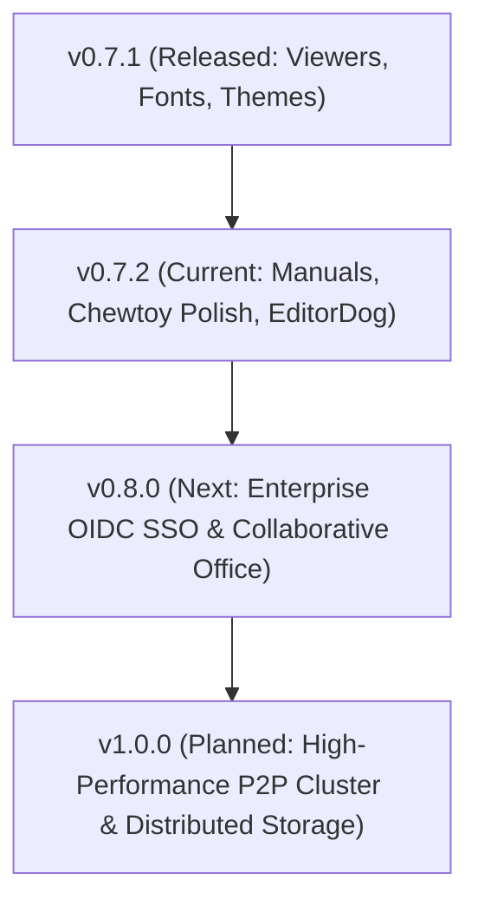

#  CommanderDog Product Roadmap & Task Backlog

> **Creator & Lab**: Bolt J Woofson @ Woofsons Lab ([www.arf.ac](https://www.arf.ac))  
> **Slogan**: *Multi-Tab File Commander for Web & Native Desktop — By Woofson*  
> **Current Version**: `v0.7.2-rc1 (Desktop & Web)`  
> **Publishing Prefix Rule**: All crates, binaries, and packages use the `arf-` or `arf_` prefix (e.g. `arf-cmdr`, `arf-remote`).

---

## 1. 🌟 The Ultimate Replacement Vision: One Commander ("ChewToys")

> *"Replace a scattered suite of 10+ disconnected utilities with a single, ultra-fast, unified Commander and a suite of built-in power-tools ('ChewToys')."*

```
┌────────────────────────────────────────────────────────────────────────────────────────────┐
│ The CommanderDog "ChewToy" Replacement Matrix                                              │
├────────────────────────┬─────────────────────────────┬─────────────────────────────────────┤
│ Legacy / External App  │ CommanderDog Native ChewToy │ Replaced Capabilities               │
├────────────────────────┼─────────────────────────────┼─────────────────────────────────────┤
│ FileZilla & Mountain D │ Native Multi-Protocol VFS   │ SFTP/SSH, SMB/CIFS, NFS, WebDAV,    │
│                        │                             │ Hetzner Storage Box, Proton Drive,  │
│                        │                             │ Google Drive & S3 Object Storage    │
├────────────────────────┼─────────────────────────────┼─────────────────────────────────────┤
│ rclone & rsync         │ DeltaCopy / RoboCopy        │ Differential delta streaming,       │
│                        │ Engine & Background Tasks   │ bandwidth throttling & auto-retry   │
├────────────────────────┼─────────────────────────────┼─────────────────────────────────────┤
│ Bvckup 2 & SyncToy     │ Delta Backup & Sync Studio  │ 4 replication profiles, in-place    │
│                        │                             │ block deltas, snapshots & scheduler │
├────────────────────────┼─────────────────────────────┼─────────────────────────────────────┤
│ Syncthing              │ Live Syncthing Dashboard    │ Peer status, throughput charts,     │
│                        │ & Direct Local/LAN Sync     │ folder scan triggers, P2P sync      │
├────────────────────────┼─────────────────────────────┼─────────────────────────────────────┤
│ PuTTY & OpenSSH SCP    │ Slide-Up PTY Web Terminal   │ Embedded WebSocket pseudo-terminal  │
│                        │ (Bite!)                     │ (fish/zsh/bash/powershell) in path  │
├────────────────────────┼─────────────────────────────┼─────────────────────────────────────┤
│ Total / Multi / MC /   │ 1-to-4 Multi-Tab Dynamic    │ Orthodox keyboard shortcuts, dual-  │
│ XYplorer / Directory O │ Panes & Orthodox Suite      │ pane power diff, batch rename,      │
│                        │                             │ branch view, rich MIME icon suite   │
├────────────────────────┼─────────────────────────────┼─────────────────────────────────────┤
│ Cryptomator / VeraCrypt│ AES-256-GCM Vaults          │ Zero-leakage in-memory containers   │
│                        │ (.cdvault)                  │ (Argon2id + AES-GCM RAM-only VFS)   │
├────────────────────────┼─────────────────────────────┼─────────────────────────────────────┤
│ HandBrake / FFmpeg GUI │ ConvertX Transcoder         │ Browser-native image/audio/video/   │
│                        │                             │ document conversion engine          │
├────────────────────────┼─────────────────────────────┼─────────────────────────────────────┤
│ PDFsam / Acrobat Split │ PDF Power Studio            │ Pure-Rust visual merge, split,      │
│                        │                             │ page reordering & rotation grid     │
├────────────────────────┼─────────────────────────────┼─────────────────────────────────────┤
│ FastStone / Feh Viewer │ High-DPI Image Viewer       │ Mouse wheel browse, focal zoom,     │
│                        │                             │ slideshow, format conversion        │
├────────────────────────┼─────────────────────────────┼─────────────────────────────────────┤
│ Obsidian / Joplin      │ NoteDog Notes Studio        │ Hierarchical Markdown notebook,     │
│                        │                             │ checklists, revision diff history   │
└────────────────────────┴─────────────────────────────┴─────────────────────────────────────┘
```

---

## 2. 🎨 Design Language & Viewport Standards

### Standardized Viewports
* **`Phone`**: Mobile touch screens. Chewtoys open as overlay apps with minimal subtle headers.
* **`Tablet`**: Foldables & tablets touch. Responsive multi-column layout with touch targets.
* **`PC`**: Desktop / Laptop mouse & keyboard. Chewtoys are fully resizable and dockable into panels.

### UI & Chewtoy Design System
* **Panels vs Tabs**: File browsing panes are strictly termed **"Panels"**; **"Tabs"** are strictly reserved for settings and editor tabs.
* **Uniform Header Layout**:
  * Main header: Left space is Branding + Hostname badge; middle-right is Tasks and Chewtoy Apps; most right is User Profile & Settings (<kbd>F10</kbd>).
  * Action buttons across all tools and viewers share a uniform **`28px` height**, look, and feel.
  * Window control buttons (Close, Minimize, Maximize, Dock/Float) are neat, subtle, and consistent across all tools.
  * Full title bars serve as non-fiddly drag handles (`cursor: grab;`).
* **Official Themes**:
  * **`Woofsons Amber Charcoal`** (Dark - Default)
  * **`Woofsons Amber Zink`** (Light)

---

## 3. 🚀 Active Sprint & Chewtoy Improvement Backlog (`v0.7.2`)



### Active Tasks (`v0.7.2`):
- [x] **Documentation Reorganization & `manuals/` Directory (`v0.7.2-rc1`)**:
  - Reorganized loose root documentation into dedicated [`manuals/`](manuals/README.md).
  - Created [`manuals/chewtoys.md`](manuals/chewtoys.md), [`manuals/docker.md`](manuals/docker.md), [`manuals/lxc-proxmox.md`](manuals/lxc-proxmox.md), [`manuals/windows.md`](manuals/windows.md), [`manuals/reverse-proxy.md`](manuals/reverse-proxy.md), [`manuals/vaults.md`](manuals/vaults.md), [`manuals/themes-and-palette.md`](manuals/themes-and-palette.md), and [`manuals/qa-testing.md`](manuals/qa-testing.md).
  - Merged `todo.txt` directly into `ROADMAP.md` as the unified source of truth.
- [ ] **EditorDog Polish**:
  - Standardize Save, New, Find, and Save All buttons to uniform `28px` Chewtoy header styling.
  - Replace dropdown view/layout menu with direct action buttons.
  - Move language selection dropdown to the right of breadcrumbs; move language badge to statusbar.
- [ ] **Terminal Console (Bite!)**:
  - Handle `Ctrl+D` (EOF) / shell logout to close or cleanly disconnect the session.
  - Fix any TUI app dimension artifacts on terminal pane resize.
- [ ] **Notes Chewtoy (NoteDog)**:
  - Add resize handles in PC viewport with refined subtle header controls.
  - Remove redundant breadcrumb badge.
  - Refine docked sidebar layout when docked into panel.
- [ ] **Top Header Hostname Badge**:
  - Add customizable hostname/environment badge next to the logo for multi-host deployments.
- [ ] **Task Manager Polish**:
  - Ensure fast completed tasks cleanly dismiss without stuck UI pills.
- [ ] **Delta Backup & Sync Studio Templates**:
  - Multi-device script templates and folder exclusion builder.

---

## 4. 🔮 Upcoming Strategic Milestones

### Milestone 1: Enterprise OIDC SSO & Collaborative Office (`v0.8.0`)
- **Enterprise Identity Providers**: OpenID Connect (OIDC), OAuth2, SAML 2.0, Keycloak, Authentik, Okta, Azure AD.
- **Collaborative Document Editing**: In-browser real-time collaborative editing for markdown, code, and Office documents (`.docx`, `.xlsx`, `.pptx` via Collabora / OnlyOffice WOPI integration).

### Milestone 2: High-Performance P2P Cluster & Distributed Virtual Storage (`v1.0.0`)
- **Cluster Node Mesh**: Direct peer-to-peer authenticated node clustering with distributed metadata synchronization.
- **Distributed Virtual Storage**: Multi-host unified mountpoints and automated cross-node replication.

---

## 5. 📜 Completed Milestones (v0.1.0 — v0.7.1)

### Universal Floating Viewers, Live Log Streaming, Offline Nerd Fonts & Theme Engine (`v0.7.1`)
- [x] **Universal Floating & Resizable Viewers**:
  - Detachable floating window mode for Universal Document/Text viewer and Image viewer with window geometry persistence in `localStorage`.
  - Non-fiddly, full title bar drag handle and desktop edge/corner resizing.
  - Live log follow mode (`tail -f`) with custom line count filtering (`-n 50`, `100`, `250`, `500`, `1000`, `All`), glowing live indicator, and word-wrap toggle.
  - Unified right-aligned header layout with uniform `28px` control buttons.
- [x] **Bundled Offline JetBrainsMono Nerd Fonts**:
  - Embedded local `JetBrainsMono Nerd Font` and `Symbols Nerd Font` into the binary via `rust_embed` for native out-of-the-box `eza --icons`, `starship`, and `fish` powerline glyphs without requiring client OS font installations.
- [x] **Official Woofsons Amber Palette & Auto-Merge Engine**:
  - Added official **Woofsons Amber Charcoal** (Dark) and **Woofsons Amber Zink** (Light) themes.
  - Automatic configuration merge ensuring new built-in themes are dynamically available even on existing installations with prior `config.toml` files.
- [x] **Direct File Panel Download & Dynamic Login Screen**:
  - 1-click **Save / Download File** directly from the panel right-click context menu.
  - Procedurally randomized geometric gradient background on login/lock screen with centralized version badge sync.

### NoteDog Notes Studio & Orthodox Power Tools Suite (`v0.7.0`)
- [x] **NoteDog Hierarchical Markdown Notes Studio**:
  - Tree organizer notebook with subdirectories, drag-and-drop hierarchy, and fast keyword indexing.
  - Interactive checklists (`- [ ]`) and task tracking with instant DOM state persistence.
  - Built-in note templates (Meeting Notes, Project Plan, Checklist / SOP, Daily Journal).
  - Automated revision history snapshot engine under `.notedog_versions/` with side-by-side diff preview and 1-click restore.
- [x] **Color Labels, Tags & Workspaces**:
  - Direct metadata tagging with persistent SQLite indexes and custom color pills.
  - Quick filter toggles and workspace layout persistence.

### Bvckup 2 & SyncToy Delta Backup Engine, Background Daemons & Folder Watchers (`v0.6.9`)
- [x] **4 Core Replication Profiles (SyncToy & Bvckup 2)**:
  - `synchronize`: Smart bidirectional 2-way sync with newer-file conflict resolution.
  - `echo`: 1-way mirror making destination an exact replica, deleting destination orphans.
  - `contribute`: Additive replication copying additions & modifications, keeping destination orphans.
  - `subscribe`: Historical versioning archiving modified/deleted files into timestamped `_archive/` snapshot trees with automated retention pruning.
- [x] **Block-Level In-Place Binary Delta Copy Engine (Bvckup 2 Speed)**:
  - 64KB CRC32 chunk hashing skipping unmodified blocks and patching modified byte blocks in-place directly on disk.
  - Post-transfer cryptographic verification (CRC32/SHA-256).
- [x] **Automated Backup Profiles, Scheduler & Webhooks**:
  - SQLite persistent profile management with interval, daily (HH:MM), and continuous real-time triggers.
  - Webhook dispatchers (Discord/Slack/Telegram/generic JSON POST) alerting on completion or failure.
  - Execution history & audit logs tracking files copied, archived, deleted, and duration.
- [x] **Sync & Backup Studio Modal**:
  - 3-tab layout (Live Diff & Replication, Backup Jobs & Scheduler, Run History & Logs) with interactive mode cards and action filters.

### Resizable Columns, Custom Column Chooser, Multi-Size Grid & Folder Tree Sidebar (`v0.6.8`)
- [x] **Interactive Drag-to-Resize Table Columns**:
  - Grab-and-drag divider handles on all table headers (`Name`, `Ext`, `Size`, `Modified`, `Created`, `Mode`, `Owner`, `Group`, `SHA-256`, `Tags`).
  - Double-click resizer auto-fit scanning DOM content widths and fitting the column perfectly.
  - Sticky width layout saved to `localStorage` per pane and globally.
- [x] **Custom Column Builder & Header Settings Popover**:
  - Right-click column header chooser popover with checkbox toggles for instant customization.
  - Support for *Date Created*, *SHA-256 Checksums*, and *Color Labels / Custom Tags* in table rows.
- [x] **Thumbnail Gallery Multi-Size View Modes**:
  - 4 card preview sizes: Small (`90px`), Medium (`130px`), Large (`180px`), Extra Large (`260px`).
- [x] **Collapsible Directory Tree Sidebar Per Pane**:
  - Toggle folder tree button `[ 🌳 ]` on any pane header with dynamic asynchronous subfolder expansion.

### Orthodox Context Menus, Properties Dialog & GFM Markdown (`v0.6.7`)
- [x] **Orthodox Right-Click Context Menu & Submenus**:
  - Full-width viewport & touch fix: Dynamic collision detection flipping submenus near screen edges.
- [x] **Windows-Style Properties Dialog (`Alt+Enter`)**:
  - 4-tabbed modal: General & Media/EXIF, Security & Permissions, Checksums, Color labels & Custom tags.
- [x] **GitHub-Flavored Markdown (GFM) & HTML Rendering in EditorDog**:
  - Full raw HTML tags (`<details>`, `<summary>`, `<kbd>`, ``, `<table>`, `<div>`, etc.).

### Windows Service, Autostart Management & Rich Filetype Icon Suite (`v0.6.6`)
- [x] **Windows Background Service & Autostart Management**:
  - Integrated Windows Service controller (`commanderdog.exe --service install|start|stop|uninstall`).
- [x] **Rich MIME & File Extension Icon Engine**:
  - 50+ distinctive filetype icons with color-coded badges.

### Pure-Rust PDF Split & Merger, Mouse-Wheel Image Viewer & Dynamic Statusbar (`v0.6.5`)
- [x] **Pure-Rust PDF Engine (`lopdf`)**:
  - Merge arbitrary PDF documents with visual reordering and bookmark outlines.
  - Split by page ranges, extract each page, or split into $N$-page bundles.
- [x] **Image Viewer Mouse Wheel Navigation**:
  - Scroll mouse wheel up/down to flip through previous/next images in folder.
  - `Ctrl`+wheel cursor-centered focal zoom with instant toggle.

### Windows Native Desktop, Installers & Packaging (`v0.6.0`)
- [x] **Native Windows Desktop Integration (`CommanderDog.exe`)**:
  - Rust + Microsoft WebView2 standalone desktop integration via Tauri v2 with embedded local server.
  - Automated NSIS & WiX installer packages (`.msi` / `.exe`), portable `.zip`, Winget, and Scoop bucket.

### Transparent Encrypted Vaults & Subsystem Deletions (`v0.5.5`)
- [x] **Transparent Encrypted Vaults (`.cdvault` / `.cdv`)**:
  - Zero-knowledge AES-256-GCM authenticated encryption + Argon2id RAM-only VFS with zero plaintext disk leakage.

### Security, UI Modernization & Streamlined UX (`v0.5.0`)
- [x] **Zero-Leakage Credential Security & URI Sanitization**:
  - Ephemeral in-memory auth routing (`resolveAuthUri`) keeping passwords out of DOM and history.

---

## 6. 📊 Release Version Matrix

| Version | Milestone Focus | Status |
| :--- | :--- | :--- |
| **`v0.3.0`** | In-Pane Tool Docking, ConvertX, Dual-Pane Editor | **Released** |
| **`v0.3.5`** | Wayland Native Windowing, GDK Error 71 Fix, AUR Automated Sync | **Released** |
| **`v0.3.6`** | XDG Fast-Path Config, External TOML Themes, Web Theme Creator, Tiling WM Frameless | **Released** |
| **`v0.4.0`** | Multi-Part File Splitter & Combiner, Integrated Git Client, Auto-$HOME Startup | **Released** |
| **`v0.4.1`** | Configurable Storage Roots, Filesystem Sandboxing, Per-User Root RBAC, Multi-Arch Alpine/Debian GHCR | **Released** |
| **`v0.4.2`** | Multi-Tier SSH/SFTP Auth, Dynamic PAM Zero-Dependency Engine, SFTP $HOME Resolution | **Released** |
| **`v0.5.0`** | Zero-Leakage In-Memory Credentials, Leftmost Unified Pane Customizer, Modern Navbar, Tauri Tray | **Released** |
| **`v0.5.5`** | Transparent Encrypted Vaults (AES-256-GCM / Argon2id), Cross-Mount Deletion Engine | **Released** |
| **`v0.6.0`** | Windows Native Build & Release (MSI, Portable ZIP, Winget, Scoop, WebView2) | **Released** |
| **`v0.6.5`** | PDF Split/Merger, Mouse-Wheel Image Navigation & Dynamic Statusbar Selection | **Released** |
| **`v0.6.6`** | Windows Service, Autostart Management & Rich Filetype Icon Suite | **Released** |
| **`v0.6.7`** | Orthodox Context Menu, Properties Dialog, GFM & Raw HTML Editor, Tags & Colors | **Released** |
| **`v0.6.8`** | Resizable Columns, Custom Chooser, Multi-Size Grid & Tree Sidebar | **Released** |
| **`v0.6.9`** | Bvckup 2 & SyncToy Delta Backup, Background Daemons, Scheduled Tasks & Automation | **Released** |
| **`v0.7.0`** | NoteDog Notes Studio, Tags & Colors, Custom Workspaces & Power Suite | **Released** |
| **`v0.7.1`** | Universal Floating Viewers, Live Tail Follow, Bundled Fonts & Theme Engine | **Released** |
| **`v0.7.2`** | Documentation Reorganization & Chewtoy UI/UX Refinements | **In Progress** |
| **`v0.8.0`** | Enterprise OIDC SSO, Collaborative Office (WOPI) & Automation Engine | *Planned* |
| **`v1.0.0`** | High-Performance P2P Cluster & Distributed Virtual Storage | *Planned* |
