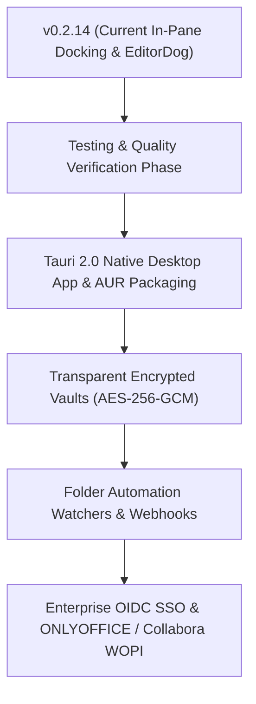

# 🗺️ CommanderDog Product Roadmap

> **Slogan**: *Multi-Tab Web Commander — By Woofson*  
> **Current Version**: `v0.2.14 (Active Development)`

This roadmap outlines planned capabilities, UX enhancements, and architectural milestones for CommanderDog, merging orthodox file commander power tools (Total Commander, Double Commander, Krusader, Directory Opus) with modern responsive web architecture.

---

## 🚀 1. Completed Milestones (v0.1.0 — v0.2.14)

- [x] **🪟 In-Pane Tool Docking & Non-Blocking Workflow (`v0.2.14`)**: 1-click `⇲ Dock into Active Pane` across all floating tools with 1-click undock (`⇱ Float`) restoring the file browser:
  - **EditorDog**: Multi-tab code editor with dirty markers, tab switching, and touch-optimized mobile action sheet menu.
  - **Terminal Console**: Live interactive xterm.js PTY WebSocket terminal mounted in-pane.
  - **Byte Calculator**: Full feature parity with floating window (Hex/Oct/Bin converters, storage multipliers `KB`-`TB`, history tape) scaled & left-aligned (`max-width: 340px`).
  - **Background Transfers & Queue**: Real-time batch progress, TeraCopy stream, speed/ETA stats, and interactive job queue list with pause/resume/cancel controls.
  - **Git Manager**: Direct working tree inspection and repository staging.
- [x] **🌲 Integrated Git Client & Version Control Engine (`v0.2.14`)**: Real-time git status indicators and branch badges on pane breadcrumbs, side-by-side git diff viewer, visual staging (`+` / `-`), commit composer, Push/Pull actions, and commit history log viewer.
- [x] **🌐 Web Bookmarks & External URI Manager (`v0.2.14`)**: Support for `https://...` URLs, external web apps, and custom schemes with target choice (`_blank` tab or in-app).
- [x] **🏷️ Custom Pane Renaming & Workspace Aliases (`v0.2.14`)**: Interactive tab double-click / right-click pane label customization persisted across reloads.
- [x] **🧩 Multi-Part File Splitter & Combiner (`v0.2.14`)**: Chunk splitting (10MB, 50MB, 100MB, 1GB, custom) with automatic `.sha256` manifest generation, part file concatenation (`.001`, `.002`...), and SHA-256 integrity verification.
- [x] **📱 Mobile, Foldable & Touch Viewports (`v0.2.14`)**:
  - Adaptive dual-pane breakpoint ($\ge 601\text{px}$) for foldable screens (Galaxy Z Fold, Pixel Fold, OnePlus Open).
  - CSS Viewport Segments & hinge-avoidance (`horizontal-viewport-segments: 2`).
  - Mobile action sheet drawer for EditorDog with large finger-friendly touch targets ($\ge 44\text{px}$) and touch-scrolling tab strip.
- [x] **🌲 Flat / Branch View (<kbd>Ctrl+B</kbd>)**: Recursive directory flattening into a unified pane view with global sorting (by size/date) and full batch operations.
- [x] **🔍 Live Content Grep & "Feed to Pane"**: Deep regex content search across trees with line snippets and 1-click **"Feed to Pane"** virtual results for batch operations.
- [x] **🏷️ Color Labels & Custom Tagging System**: SQLite-persisted color labels (🔴, 🟠, 🟡, 🟢, 🔵, 🟣) and custom text tag chips with context menu palette and interactive tag manager.
- [x] **🔀 Two-Way Visual Directory Synchronizer**: Side-by-side comparison between Left & Right directories with visual status indicators (**Newer ➔**, **Older ⬅**, **Identical ✔**, **Different Size ⚠️**, **Delete ✕**), 1-click direction override toggles, category filter chips, and Mirror/Smart 2-Way execution.
- [x] **📊 Visual Disk Usage Treemap & Storage Analyzer**: Rust recursive space aggregation engine with percentage consumption bars, 1-click folder drill-down, and Top 20 largest files table.
- [x] **📦 In-Browser Archive Engine**: Compress & Extract `.zip`, `.tar.gz`, `.tar.bz2`, `.tar.xz`, and `.7z` with custom compression levels.
- [x] **🔗 Link Sharing & Guest Upload Dropboxes**: Time/download-limited share links, password protection, guest `/share/:token` upload dropboxes, and active shares audit dashboard.
- [x] **⚡ Global Spotlight Quick-Switcher (<kbd>Ctrl+K</kbd> / <kbd>Cmd+K</kbd>)**: Real-time fuzzy command palette searching across actions, common paths, bookmarks, and recent history.
- [x] **📚 Universal Document & PDF Reader**: In-browser PDF stream viewer with zoom/rotate/print/fullscreen, rich GitHub Markdown renderer with raw toggle, CSV/TSV interactive data grids with filter and sort, and web previews.
- [x] **📸 Rich Media Inspector & EXIF GPS Geotag Engine**: TIFF/EXIF binary camera parser, interactive Leaflet + OpenStreetMap location pin with Google/Apple Maps links, dominant color palette extraction, and byte-range video/audio stream player.
- [x] **🔐 Visual POSIX Permissions Matrix**: Visual $3\times 3$ `chmod`/`chown` matrix with octal calculator and recursive `-R` toggle.
- [x] **☁️ Multi-Cloud & Remote Storage**: SMB/CIFS, NFS, AWS S3/MinIO/R2, SFTP, WebDAV, Syncthing, and Proton Drive.

---

## 🎯 2. Active Upcoming Priorities

### 🖥️ 1. Standalone Native Desktop App (Tauri 2.0) & AUR Packaging
- **Zero-Electron Rust Architecture**: Embed Axum local server with native WebKitGTK (Linux), WebKit (macOS), and WebView2 (Windows) for ultra-low memory consumption (~30 MB RAM) and small binary size (~15 MB).
- **Arch User Repository (AUR)**:
  - `commanderdog` (Source build with Cargo)
  - `commanderdog-bin` (Pre-compiled optimized release package for CachyOS & Arch Linux)
- **Native OS Integrations**: System tray icon with background minimize, global summon hotkey (e.g. <kbd>Super+C</kbd>), native OS drag-and-drop, and window chrome.
- **Cross-Platform Packages**: Linux (`AUR`, `.AppImage`, `.deb`, `.rpm`), macOS (`.dmg`, `.app`, Homebrew), Windows (`.msi`, `.exe`, WinGet).

### 🔒 2. Transparent Encrypted Vaults (AES-256-GCM / Argon2id)
- **Zero-Knowledge Encrypted Folders**: Create password-protected encrypted vault directories.
- **On-the-Fly Decryption**: Files decrypt transparently in memory inside CommanderDog without exposing unencrypted files on disk.

### ⚙️ 3. Webhook & Automation Triggers
- **Folder Watchers**: Trigger automated actions when files arrive in a folder (e.g. auto-convert with ConvertX, decompress downloads, or run custom scripts).

### 🌐 4. OpenID Connect (OIDC) & SSO Integration
- **Enterprise SSO**: Support OpenID Connect (Authelia, Authentik, Keycloak, Okta, Google Workspace) alongside existing Linux PAM and SQLite auth engines with RBAC group mapping.

### 📄 5. Collaborative Office Editing (ONLYOFFICE & Collabora WOPI)
- **WOPI / ONLYOFFICE Integration**: Live collaborative editing for `.docx`, `.xlsx`, `.pptx`, `.odt`, `.ods` directly within CommanderDog.

---

## 📋 3. Release Phasing Matrix

| Phase | Milestone | Focus Areas |
| :--- | :--- | :--- |
| **Phase 1** | **`v0.2.14`** *(Completed)* | In-Pane Docking (EditorDog, Terminal, Scaled Calculator, Tasks, Git), Foldable Dual-Pane $\ge 601\text{px}$, Mobile Touch Menus. |
| **Phase 2** | **`v0.3.0`** *(Next)* | Tauri 2.0 Native Desktop Application, CachyOS / Arch Linux AUR packages (`commanderdog`, `commanderdog-bin`). |
| **Phase 3** | **`v0.3.5`** | Transparent Encrypted Vaults (AES-256-GCM / Argon2id in-memory decryption). |
| **Phase 4** | **`v0.4.0`** | Folder Automation Watchers & Webhook trigger rules. |
| **Phase 5** | **`v0.5.0`** | Enterprise OIDC SSO, Collaborative ONLYOFFICE & Collabora WOPI integration. |

