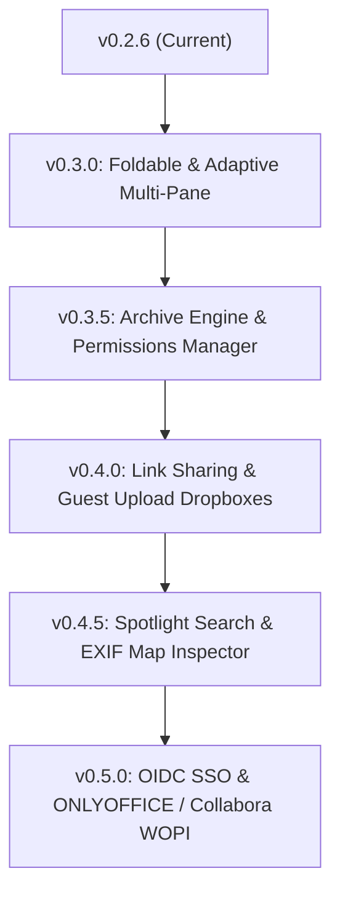

# 🗺️ CommanderDog Product Roadmap

> **Slogan**: *Multi-Tab Web Commander - By Woofson*

This roadmap outlines planned capabilities, UX enhancements, and architectural milestones for CommanderDog, informed by an architectural evaluation of orthodox file commanders, modern cloud file managers (including [NextExplorer](https://github.com/Woofson/NextExplorer)), and adaptive multi-pane mobile form factors.

---

## 📱 1. Foldable & Tablet Adaptive Multi-Pane (Immediate Priority)

### 📐 The Challenge:
Current responsive design collapses viewports $\le 768\text{px}$ into a single-pane vertical stack. Modern foldable devices (such as Samsung Galaxy Z Fold, Google Pixel Fold, OnePlus Open) feature outer screens ($\sim 380\text{px}$–$420\text{px}$) and inner unfolded screens ($\sim 600\text{px}$–$900\text{px}$) with square/portrait aspect ratios ($\approx 4:3$, $6:5$, or $1:1$). Users unfolding their devices expect **at least two active panes side-by-side** for true orthodox dual-pane file management.

### 🎯 Roadmap Initiatives:
- **Dual-Pane Foldable Breakpoint ($\ge 600\text{px}$)**:
  - Transition from strict $768\text{px}$ single-pane to an adaptive dual-pane layout when horizontal width $\ge 600\text{px}$.
  - Support dual vertical panes (`layout-dual-vertical`) with compact columns (Icon + Name + Size) on foldable screens.
- **CSS Screen-Spanning & Viewport Segments**:
  - Leverage `@media (horizontal-viewport-segments: 2)` and `screen-spanning: single-fold-vertical` to place Pane 1 on the left display half and Pane 2 on the right display half, avoiding the center hinge/fold seam.
- **Touch-Optimized Drag & Swipe Across Folded Panes**:
  - Direct touch drag-and-drop or 1-tap "Transfer to Opposite Pane" buttons on foldable touch interfaces.
  - Quick-switch tabs for Pane 3 & 4 while preserving the primary dual-pane split on screen.

---

## 🔍 2. Evaluated Features from NextExplorer (`../NextExplorer/`)

NextExplorer offers a modern web explorer interface with rich media, sharing, and integration capabilities. The following high-value features have been evaluated and prioritized for CommanderDog:

### 🔗 A. Temporary Link Sharing & Guest Upload Dropboxes
- **Public & Password-Protected Shares**: Generate secure, time-limited share links for individual files or entire folders (`1 hour`, `24 hours`, `7 days`, `custom expiration`).
- **Read-Write Guest Dropboxes**: Allow external collaborators to upload files directly into a designated target directory via a clean web drop-zone without requiring a user account.
- **Active Shares Dashboard**: Built-in tab in the Settings/Profile Hub to monitor, audit access logs, extend expiry, or revoke active links in one click.

### 📄 B. Document Viewing & Collaborative Editing (ONLYOFFICE & Collabora WOPI)
- **WOPI / ONLYOFFICE Integration**: Connect to an external or self-hosted ONLYOFFICE DocumentServer or Collabora Online instance.
- **In-Browser Office Editing**: Edit `.docx`, `.xlsx`, `.pptx`, `.odt`, `.ods` directly within CommanderDog floating windows with real-time multi-user collaboration.

### 🗺️ C. Rich Media Inspector & EXIF GPS Map Preview
- **EXIF Metadata Inspector**: View detailed camera metadata (shutter speed, aperture, ISO, focal length, camera body & lens model).
- **Interactive GPS Location Preview**: For geotagged photos, embed a lightweight interactive map preview showing the exact coordinates where the image was captured.
- **Audio & Video Codec Details**: Inspect bitrates, audio channels, video codecs, and container formats.

### ⚡ D. Global Spotlight Quick-Switcher (`Ctrl+K` / `Cmd+K`)
- **Spotlight Search Bar**: Modal overlay triggered anywhere via `Ctrl+K` for instantaneous fuzzy matching across recent files, bookmarks, active mounts, commands, and settings.
- **Keyboard-First Navigation**: Instant directory jumping without leaving the active panel.

### 📦 E. Archive Manager & In-Browser Unpacker
- **Multi-Format Extraction**: In-browser decompression and extraction for `.zip`, `.tar.gz`, `.tar.bz2`, `.tar.xz`, `.7z`, and `.rar` directly to the active or opposite pane.
- **Archive Creation**: Select multiple files/folders and compress directly to `.zip` or `.tar.gz` with custom compression levels.

### 🔐 F. POSIX & ACL Visual Permissions Editor
- **Visual Chmod/Chown**: Intuitive octal (`755`, `644`) permission matrix with checkbox grid for Owner, Group, and Others (Read, Write, Execute, SUID, SGID, Sticky).
- **Recursive Permission Apply**: Option to recursively apply ownership/permissions to subdirectories and files.

### 🌐 G. OpenID Connect (OIDC) & SSO Integration
- **Enterprise SSO**: Support OpenID Connect (OIDC) authentication flows (Authelia, Authentik, Keycloak, Okta, Google Workspace) alongside existing Linux PAM and SQLite auth engines.
- **Role & Group Mapping**: Map OIDC group claims directly to CommanderDog RBAC roles (`admin`, `power_user`, `user`, `viewer`).

---

## 📋 3. Architecture & Release Milestone Phasing

| Phase | Milestone | Focus Areas |
| :--- | :--- | :--- |
| **Phase 1** | **`v0.3.0`** | Foldable phone ($\ge 600\text{px}$) dual-pane UX, hinge/seam-aware layout, touch splitter. |
| **Phase 2** | **`v0.3.5`** | In-browser Archive Extractor (`.zip`, `.tar.gz`, `.7z`), Visual POSIX Chmod/Chown panel. |
| **Phase 3** | **`v0.4.0`** | Link-based sharing, guest upload dropboxes, password & expiry tokens, shares dashboard. |
| **Phase 4** | **`v0.4.5`** | Global Spotlight switcher (<kbd>Ctrl+K</kbd>), EXIF GPS Map preview, media audio/video inspection. |
| **Phase 5** | **`v0.5.0`** | OIDC / SSO integration, ONLYOFFICE & Collabora document editing integration. |
