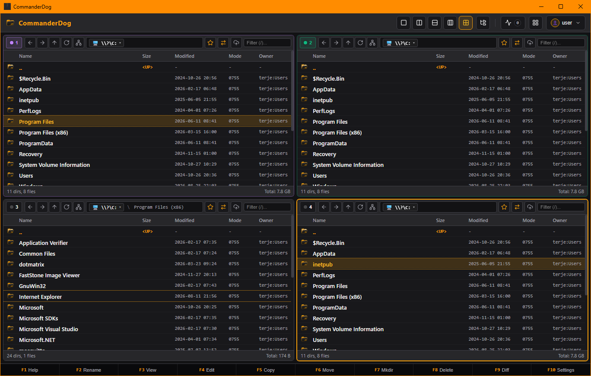

#  CommanderDog for Windows

<div align="center">
  
</div>

> **Multi-Tab File Commander for Web & Native Windows Desktop**  
> *Engineered in Rust & Microsoft WebView2 — High-Performance, Low Memory, Zero Electron Overhead.*

---

## 1. Overview & Architecture

CommanderDog on Windows is distributed as:
1. **Standalone Native Desktop Application (`CommanderDog.exe`)**:
   - Powered by Tauri v2 with Microsoft WebView2 (built into Windows 10 & 11).
   - Instant startup, ~30MB RAM idle consumption, full hardware-accelerated rendering.
   - Global System Tray icon with minimize-to-tray background operation.
2. **High-Performance Background & CLI Server (`commanderdog.exe`)**:
   - Single-binary Axum async HTTP/WebSocket server.
   - Run as a headless background service, local server, or portable command-line tool.

---

## 2. Installation Options

### A. Windows Package Manager (`winget`)
Install with a single command from PowerShell or Windows Terminal:
```powershell
winget install Woofson.CommanderDog
```

### B. Scoop Package Manager
Install via Scoop bucket:
```powershell
# From local bucket or repository
scoop install packaging\windows\scoop\commanderdog.json
```

### C. 1-Click Setup Installer (`.exe` NSIS / `.msi` WiX)
1. Download `CommanderDog_x64-setup.exe` or `CommanderDog_x64_en-US.msi` from [GitHub Releases](https://github.com/woofson/commanderdog/releases).
2. Run the installer to create Start Menu, Desktop shortcuts, and auto-configure file associations.

### D. Zero-Install Standalone Portable ZIP
1. Download `commanderdog-v0.6.0-windows-x86_64.zip`.
2. Extract anywhere (e.g. `C:\Tools\CommanderDog` or a USB drive).
3. Double-click `CommanderDog.exe` — settings and database are saved portably in the same folder or `%APPDATA%\commanderdog\`.

---

## 3. Windows Explorer Context Menu Integration

Add **"Open in CommanderDog"** to the Windows Explorer right-click context menu for any directory, drive, or folder background:

### Register Context Menu:
Double-click `packaging\windows\register-context-menu.reg` or run:
```powershell
reg import packaging\windows\register-context-menu.reg
```

### Unregister Context Menu:
Double-click `packaging\windows\unregister-context-menu.reg` or run:
```powershell
reg import packaging\windows\unregister-context-menu.reg
```

---

## 4. Windows Filesystem Features

- **Drive Letter Navigation**: Switch seamlessly across `C:\`, `D:\`, `E:\`, `Z:\` in breadcrumbs and the quick jump menu.
- **Environment Variable Expansion**: Navigate directly to `%USERPROFILE%`, `%APPDATA%`, `%LOCALAPPDATA%`, `%TEMP%`, or `~/`.
- **Windows SMB & UNC Paths**: Open and browse network shares transparently using UNC format (`\\server\share\folder`) or orthodox `smb://user@server/share`.
- **Integrated Windows PowerShell / CMD Terminal**: Embedded slide-up terminal console defaulting to Windows PowerShell or `COMSPEC` (`cmd.exe`).
- **Transparent Encrypted Vaults (`.cdvault`)**: Password-protected AES-256-GCM / Argon2id zero-knowledge virtual storage containers.

---

## 5. Building from Source on Windows

### Prerequisites
- [Rust & Cargo](https://rustup.rs/) (`stable-x86_64-pc-windows-msvc`)
- Visual Studio 2022 C++ Build Tools or Windows SDK
- Microsoft WebView2 Runtime (Preinstalled on Windows 10/11)
- Tauri CLI: `cargo install tauri-cli --version "^2.0.0"`

### Build Script
Run the automated build script in PowerShell:
```powershell
Set-ExecutionPolicy -Scope Process -ExecutionPolicy Bypass
.\packaging\windows\build-windows.ps1 -Release
```

Build outputs will be generated in `dist\windows\`:
- `dist\windows\commanderdog-v0.6.0-windows-x86_64.zip` (Portable Distribution)
- `dist\windows\SHA256SUMS.txt` (Integrity Hashes)
- `src-tauri\target\x86_64-pc-windows-msvc\release\bundle\nsis\*.exe` (Installer)
- `src-tauri\target\x86_64-pc-windows-msvc\release\bundle\msi\*.msi` (MSI Package)

---

## License
MIT License — Copyright (c) 2026 Bolt J Woofson <bolt@boop.no>
